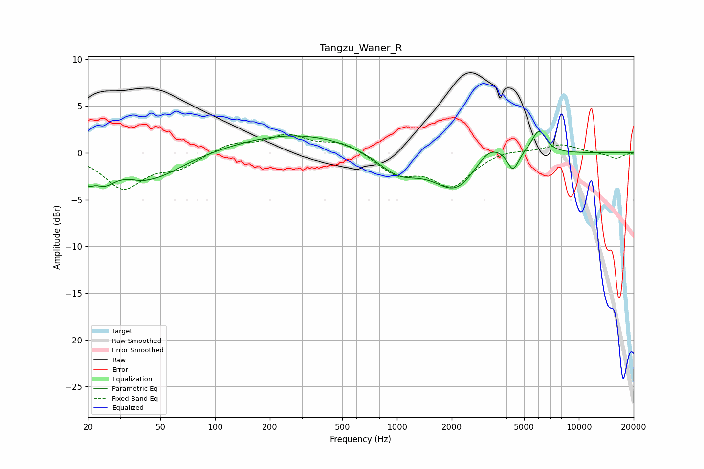

# Tangzu_Waner_R
See [usage instructions](https://github.com/jaakkopasanen/AutoEq#usage) for more options and info.

### Parametric EQs
Apply preamp of -2.4 dB when using parametric equalizer.

|   # | Type    |   Fc (Hz) |    Q |   Gain (dB) |
|-----|---------|-----------|------|-------------|
|   1 | Peaking |        20 | 4.93 |        -1.6 |
|   2 | Peaking |        24 | 2.28 |        -2   |
|   3 | Peaking |        39 | 5.31 |        -0.1 |
|   4 | Peaking |        44 | 0.85 |        -2.8 |
|   5 | Peaking |       283 | 0.42 |         2.1 |
|   6 | Peaking |      1016 | 1.2  |        -2.3 |
|   7 | Peaking |      2119 | 1.18 |        -4   |
|   8 | Peaking |      3227 | 1.73 |         2   |
|   9 | Peaking |      4345 | 4.71 |        -2.1 |
|  10 | Peaking |      6030 | 3.4  |         2.6 |

### Fixed Band EQs
When using fixed band (also called graphic) equalizer, apply preamp of **-2.1 dB** (if available) and set gains manually with these parameters.

|   # | Type    |   Fc (Hz) |    Q |   Gain (dB) |
|-----|---------|-----------|------|-------------|
|   1 | Peaking |        31 | 1.41 |        -3.7 |
|   2 | Peaking |        62 | 1.41 |        -1.4 |
|   3 | Peaking |       125 | 1.41 |         1   |
|   4 | Peaking |       250 | 1.41 |         1.8 |
|   5 | Peaking |       500 | 1.41 |         1.1 |
|   6 | Peaking |      1000 | 1.41 |        -2.1 |
|   7 | Peaking |      2000 | 1.41 |        -3.4 |
|   8 | Peaking |      4000 | 1.41 |         0.4 |
|   9 | Peaking |      8000 | 1.41 |         0.9 |
|  10 | Peaking |     16000 | 1.41 |        -0.6 |

### Graphs

