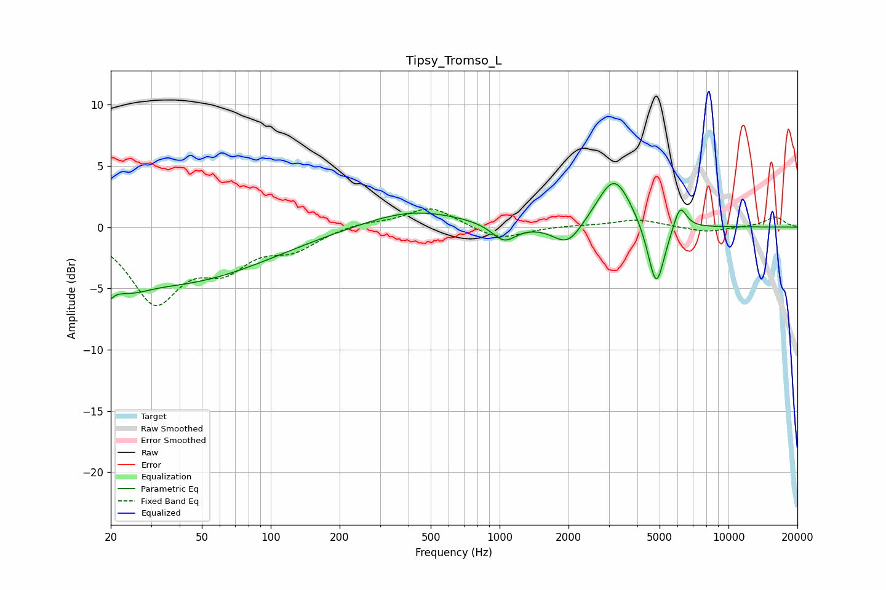

# Tipsy_Tromso_L
See [usage instructions](https://github.com/jaakkopasanen/AutoEq#usage) for more options and info.

### Parametric EQs
Apply preamp of -3.6 dB when using parametric equalizer.

|   # | Type    |   Fc (Hz) |    Q |   Gain (dB) |
|-----|---------|-----------|------|-------------|
|   1 | Peaking |        20 | 5.49 |        -4.7 |
|   2 | Peaking |        20 | 5.99 |         3.2 |
|   3 | Peaking |        24 | 1.68 |        -1.1 |
|   4 | Peaking |        38 | 0.36 |        -4.4 |
|   5 | Peaking |       415 | 0.66 |         1.5 |
|   6 | Peaking |      1046 | 2.67 |        -1.4 |
|   7 | Peaking |      1984 | 2.2  |        -1.9 |
|   8 | Peaking |      3168 | 1.88 |         4.3 |
|   9 | Peaking |      4833 | 3.77 |        -5.5 |
|  10 | Peaking |      6140 | 4.85 |         2   |

### Fixed Band EQs
When using fixed band (also called graphic) equalizer, apply preamp of **-1.6 dB** (if available) and set gains manually with these parameters.

|   # | Type    |   Fc (Hz) |    Q |   Gain (dB) |
|-----|---------|-----------|------|-------------|
|   1 | Peaking |        31 | 1.41 |        -5.8 |
|   2 | Peaking |        62 | 1.41 |        -2.8 |
|   3 | Peaking |       125 | 1.41 |        -1.6 |
|   4 | Peaking |       250 | 1.41 |         0.4 |
|   5 | Peaking |       500 | 1.41 |         1.7 |
|   6 | Peaking |      1000 | 1.41 |        -1.1 |
|   7 | Peaking |      2000 | 1.41 |         0.1 |
|   8 | Peaking |      4000 | 1.41 |         0.6 |
|   9 | Peaking |      8000 | 1.41 |        -0.4 |
|  10 | Peaking |     16000 | 1.41 |         0.8 |

### Graphs

