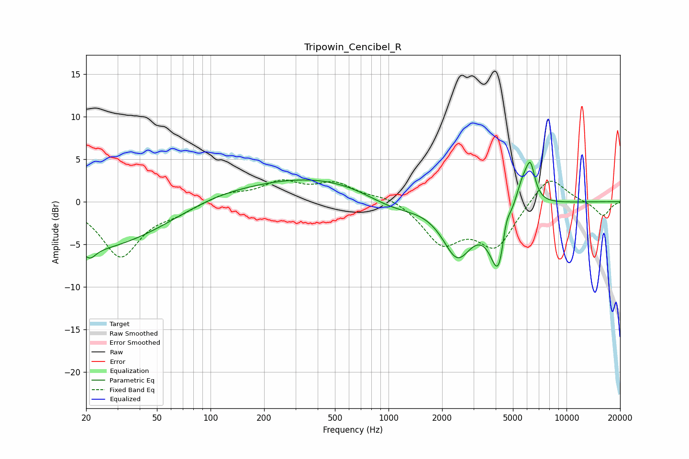

# Tripowin_Cencibel_R
See [usage instructions](https://github.com/jaakkopasanen/AutoEq#usage) for more options and info.

### Parametric EQs
Apply preamp of -4.7 dB when using parametric equalizer.

|   # | Type    |   Fc (Hz) |    Q |   Gain (dB) |
|-----|---------|-----------|------|-------------|
|   1 | Peaking |        20 | 0.32 |        -5.7 |
|   2 | Peaking |        21 | 4.62 |        -1.1 |
|   3 | Peaking |       101 | 0.66 |         0.9 |
|   4 | Peaking |       460 | 0.32 |         3.1 |
|   5 | Peaking |      1047 | 0.81 |        -2.3 |
|   6 | Peaking |      2434 | 1.69 |        -6.1 |
|   7 | Peaking |      4203 | 2.81 |        -9   |
|   8 | Peaking |      4549 | 4.99 |         3.8 |
|   9 | Peaking |      5673 | 3.01 |         3.7 |
|  10 | Peaking |      6277 | 5.51 |         3.5 |

### Fixed Band EQs
When using fixed band (also called graphic) equalizer, apply preamp of **-2.7 dB** (if available) and set gains manually with these parameters.

|   # | Type    |   Fc (Hz) |    Q |   Gain (dB) |
|-----|---------|-----------|------|-------------|
|   1 | Peaking |        31 | 1.41 |        -6.4 |
|   2 | Peaking |        62 | 1.41 |        -1   |
|   3 | Peaking |       125 | 1.41 |         1   |
|   4 | Peaking |       250 | 1.41 |         2.1 |
|   5 | Peaking |       500 | 1.41 |         2   |
|   6 | Peaking |      1000 | 1.41 |         0.7 |
|   7 | Peaking |      2000 | 1.41 |        -4.6 |
|   8 | Peaking |      4000 | 1.41 |        -5.1 |
|   9 | Peaking |      8000 | 1.41 |         3.3 |
|  10 | Peaking |     16000 | 1.41 |        -1.7 |

### Graphs

