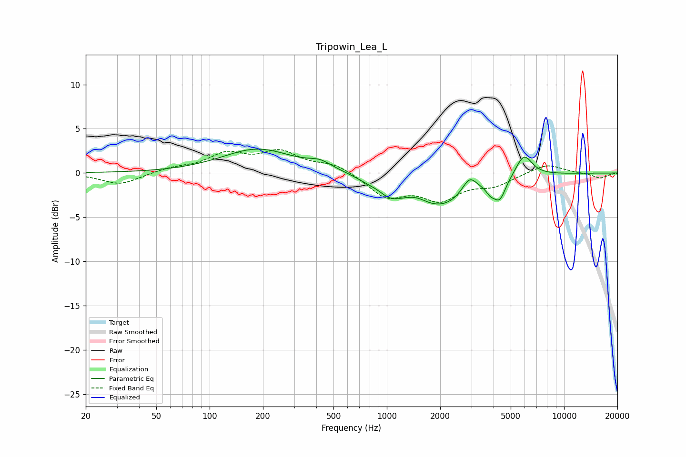

# Tripowin_Lea_L
See [usage instructions](https://github.com/jaakkopasanen/AutoEq#usage) for more options and info.

### Parametric EQs
Apply preamp of -2.8 dB when using parametric equalizer.

|   # | Type    |   Fc (Hz) |    Q |   Gain (dB) |
|-----|---------|-----------|------|-------------|
|   1 | Peaking |       187 | 0.71 |         2.7 |
|   2 | Peaking |       420 | 2.17 |         0.8 |
|   3 | Peaking |       759 | 2.38 |        -0.3 |
|   4 | Peaking |      1048 | 2.01 |        -1.6 |
|   5 | Peaking |      1489 | 3.23 |         0.3 |
|   6 | Peaking |      2033 | 0.88 |        -3.6 |
|   7 | Peaking |      2925 | 3.41 |         1.9 |
|   8 | Peaking |      3844 | 5.67 |        -0.8 |
|   9 | Peaking |      4334 | 4.13 |        -2.3 |
|  10 | Peaking |      5941 | 2.95 |         2.5 |

### Fixed Band EQs
When using fixed band (also called graphic) equalizer, apply preamp of **-2.7 dB** (if available) and set gains manually with these parameters.

|   # | Type    |   Fc (Hz) |    Q |   Gain (dB) |
|-----|---------|-----------|------|-------------|
|   1 | Peaking |        31 | 1.41 |        -1.3 |
|   2 | Peaking |        62 | 1.41 |         0.5 |
|   3 | Peaking |       125 | 1.41 |         2   |
|   4 | Peaking |       250 | 1.41 |         2.2 |
|   5 | Peaking |       500 | 1.41 |         1   |
|   6 | Peaking |      1000 | 1.41 |        -2.6 |
|   7 | Peaking |      2000 | 1.41 |        -2.7 |
|   8 | Peaking |      4000 | 1.41 |        -1.2 |
|   9 | Peaking |      8000 | 1.41 |         1.1 |
|  10 | Peaking |     16000 | 1.41 |        -0.6 |

### Graphs

