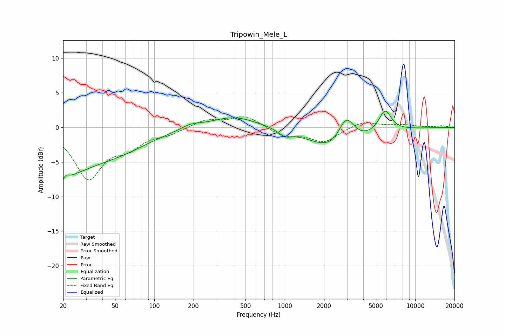

# Tripowin_Mele_L
See [usage instructions](https://github.com/jaakkopasanen/AutoEq#usage) for more options and info.

### Parametric EQs
Apply preamp of -2.5 dB when using parametric equalizer.

|   # | Type    |   Fc (Hz) |    Q |   Gain (dB) |
|-----|---------|-----------|------|-------------|
|   1 | Peaking |        20 | 0.61 |        -5.7 |
|   2 | Peaking |        20 | 4.52 |        -3.8 |
|   3 | Peaking |        21 | 5.56 |         3.2 |
|   4 | Peaking |        55 | 0.6  |        -2.4 |
|   5 | Peaking |       190 | 1.96 |         0.6 |
|   6 | Peaking |       408 | 0.79 |         1.7 |
|   7 | Peaking |      1005 | 2.94 |        -0.9 |
|   8 | Peaking |      2544 | 0.77 |        -3.9 |
|   9 | Peaking |      2960 | 2.2  |         4.5 |
|  10 | Peaking |      5868 | 2.89 |         3.2 |

### Fixed Band EQs
When using fixed band (also called graphic) equalizer, apply preamp of **-1.6 dB** (if available) and set gains manually with these parameters.

|   # | Type    |   Fc (Hz) |    Q |   Gain (dB) |
|-----|---------|-----------|------|-------------|
|   1 | Peaking |        31 | 1.41 |        -7.1 |
|   2 | Peaking |        62 | 1.41 |        -2.3 |
|   3 | Peaking |       125 | 1.41 |        -0.8 |
|   4 | Peaking |       250 | 1.41 |         1.1 |
|   5 | Peaking |       500 | 1.41 |         1.7 |
|   6 | Peaking |      1000 | 1.41 |        -1.2 |
|   7 | Peaking |      2000 | 1.41 |        -2.1 |
|   8 | Peaking |      4000 | 1.41 |         1   |
|   9 | Peaking |      8000 | 1.41 |         0.3 |
|  10 | Peaking |     16000 | 1.41 |         0.2 |

### Graphs

