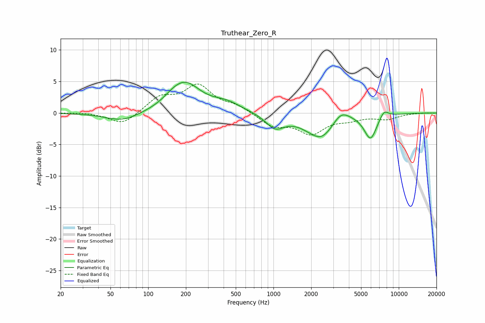

# Truthear_Zero_R
See [usage instructions](https://github.com/jaakkopasanen/AutoEq#usage) for more options and info.

### Parametric EQs
Apply preamp of -5.0 dB when using parametric equalizer.

|   # | Type    |   Fc (Hz) |    Q |   Gain (dB) |
|-----|---------|-----------|------|-------------|
|   1 | Peaking |        63 | 1.06 |        -1.4 |
|   2 | Peaking |       156 | 1.98 |         0.6 |
|   3 | Peaking |       197 | 1.16 |         4.5 |
|   4 | Peaking |       421 | 1.2  |         1.4 |
|   5 | Peaking |      1030 | 1.92 |        -2.2 |
|   6 | Peaking |      2144 | 2.27 |         0.4 |
|   7 | Peaking |      2353 | 1.25 |        -4.4 |
|   8 | Peaking |      3454 | 2.02 |         2   |
|   9 | Peaking |      5947 | 2.74 |        -4   |
|  10 | Peaking |      7619 | 3.77 |         1.3 |

### Fixed Band EQs
When using fixed band (also called graphic) equalizer, apply preamp of **-4.7 dB** (if available) and set gains manually with these parameters.

|   # | Type    |   Fc (Hz) |    Q |   Gain (dB) |
|-----|---------|-----------|------|-------------|
|   1 | Peaking |        31 | 1.41 |         0.1 |
|   2 | Peaking |        62 | 1.41 |        -2   |
|   3 | Peaking |       125 | 1.41 |         2.4 |
|   4 | Peaking |       250 | 1.41 |         4.1 |
|   5 | Peaking |       500 | 1.41 |         1   |
|   6 | Peaking |      1000 | 1.41 |        -2   |
|   7 | Peaking |      2000 | 1.41 |        -3.1 |
|   8 | Peaking |      4000 | 1.41 |        -0.8 |
|   9 | Peaking |      8000 | 1.41 |        -0.9 |
|  10 | Peaking |     16000 | 1.41 |         0   |

### Graphs

