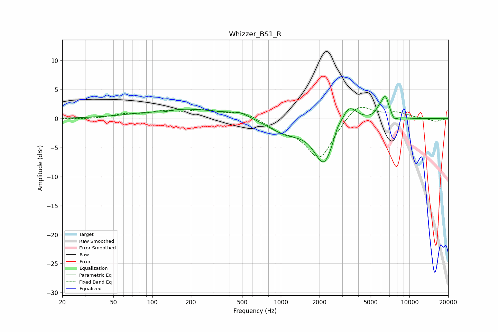

# Whizzer_BS1_R
See [usage instructions](https://github.com/jaakkopasanen/AutoEq#usage) for more options and info.

### Parametric EQs
Apply preamp of -3.9 dB when using parametric equalizer.

|   # | Type    |   Fc (Hz) |    Q |   Gain (dB) |
|-----|---------|-----------|------|-------------|
|   1 | Peaking |       123 | 2.72 |        -0.3 |
|   2 | Peaking |       177 | 0.46 |         1.7 |
|   3 | Peaking |       480 | 1.85 |         0.8 |
|   4 | Peaking |      1090 | 1.05 |        -2.2 |
|   5 | Peaking |      2168 | 1.8  |        -7.6 |
|   6 | Peaking |      2751 | 5.79 |         0.9 |
|   7 | Peaking |      3358 | 2.27 |         3.7 |
|   8 | Peaking |      5761 | 5.85 |         0.8 |
|   9 | Peaking |      6476 | 4.42 |         3.8 |
|  10 | Peaking |      7608 | 5.77 |        -0.9 |

### Fixed Band EQs
When using fixed band (also called graphic) equalizer, apply preamp of **-2.1 dB** (if available) and set gains manually with these parameters.

|   # | Type    |   Fc (Hz) |    Q |   Gain (dB) |
|-----|---------|-----------|------|-------------|
|   1 | Peaking |        31 | 1.41 |        -0.1 |
|   2 | Peaking |        62 | 1.41 |         0.7 |
|   3 | Peaking |       125 | 1.41 |         1.1 |
|   4 | Peaking |       250 | 1.41 |         1.3 |
|   5 | Peaking |       500 | 1.41 |         1.2 |
|   6 | Peaking |      1000 | 1.41 |        -1.6 |
|   7 | Peaking |      2000 | 1.41 |        -6.9 |
|   8 | Peaking |      4000 | 1.41 |         3   |
|   9 | Peaking |      8000 | 1.41 |         1   |
|  10 | Peaking |     16000 | 1.41 |        -0.5 |

### Graphs

