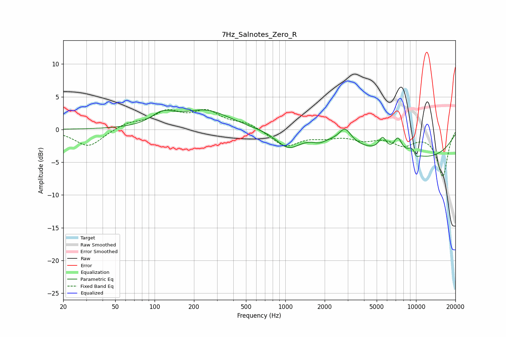

# 7Hz_Salnotes_Zero_R
See [usage instructions](https://github.com/jaakkopasanen/AutoEq#usage) for more options and info.

### Parametric EQs
Apply preamp of -3.1 dB when using parametric equalizer.

|   # | Type    |   Fc (Hz) |    Q |   Gain (dB) |
|-----|---------|-----------|------|-------------|
|   1 | Peaking |       115 | 1.63 |         1.8 |
|   2 | Peaking |       246 | 0.77 |         2.8 |
|   3 | Peaking |      1054 | 1.54 |        -2.6 |
|   4 | Peaking |      1824 | 2.75 |        -0.7 |
|   5 | Peaking |      2864 | 3.16 |         2.1 |
|   6 | Peaking |      5550 | 4.76 |         2   |
|   7 | Peaking |      7264 | 4.18 |         2.4 |
|   8 | Peaking |      9397 | 3.23 |         1.6 |
|   9 | Peaking |     10000 | 5.92 |        -1   |
|  10 | Peaking |     10000 | 0.29 |        -4.4 |

### Fixed Band EQs
When using fixed band (also called graphic) equalizer, apply preamp of **-3.1 dB** (if available) and set gains manually with these parameters.

|   # | Type    |   Fc (Hz) |    Q |   Gain (dB) |
|-----|---------|-----------|------|-------------|
|   1 | Peaking |        31 | 1.41 |        -2.7 |
|   2 | Peaking |        62 | 1.41 |         0.9 |
|   3 | Peaking |       125 | 1.41 |         2.5 |
|   4 | Peaking |       250 | 1.41 |         2.5 |
|   5 | Peaking |       500 | 1.41 |         0.9 |
|   6 | Peaking |      1000 | 1.41 |        -2.6 |
|   7 | Peaking |      2000 | 1.41 |        -0.9 |
|   8 | Peaking |      4000 | 1.41 |        -1.3 |
|   9 | Peaking |      8000 | 1.41 |        -2   |
|  10 | Peaking |     16000 | 1.41 |        -7   |

### Graphs

