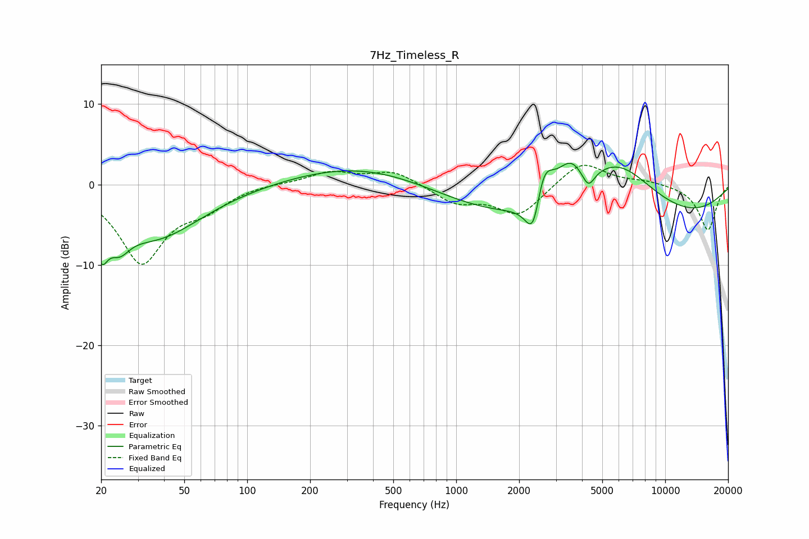

# 7Hz_Timeless_R
See [usage instructions](https://github.com/jaakkopasanen/AutoEq#usage) for more options and info.

### Parametric EQs
Apply preamp of -2.7 dB when using parametric equalizer.

|   # | Type    |   Fc (Hz) |    Q |   Gain (dB) |
|-----|---------|-----------|------|-------------|
|   1 | Peaking |        20 | 4.65 |        -4.6 |
|   2 | Peaking |        24 | 2.82 |        -3   |
|   3 | Peaking |        36 | 0.63 |        -6.5 |
|   4 | Peaking |       365 | 0.43 |         2.6 |
|   5 | Peaking |      2351 | 3.53 |        -7   |
|   6 | Peaking |      2587 | 2.86 |         6.7 |
|   7 | Peaking |      3513 | 2.28 |         3.5 |
|   8 | Peaking |      4289 | 4.7  |        -2.2 |
|   9 | Peaking |      5074 | 0.18 |        -6.8 |
|  10 | Peaking |      5852 | 0.68 |         8.5 |

### Fixed Band EQs
When using fixed band (also called graphic) equalizer, apply preamp of **-2.5 dB** (if available) and set gains manually with these parameters.

|   # | Type    |   Fc (Hz) |    Q |   Gain (dB) |
|-----|---------|-----------|------|-------------|
|   1 | Peaking |        31 | 1.41 |        -9.5 |
|   2 | Peaking |        62 | 1.41 |        -2.3 |
|   3 | Peaking |       125 | 1.41 |         0.2 |
|   4 | Peaking |       250 | 1.41 |         1.5 |
|   5 | Peaking |       500 | 1.41 |         1.7 |
|   6 | Peaking |      1000 | 1.41 |        -2.2 |
|   7 | Peaking |      2000 | 1.41 |        -3.8 |
|   8 | Peaking |      4000 | 1.41 |         3.1 |
|   9 | Peaking |      8000 | 1.41 |         0.4 |
|  10 | Peaking |     16000 | 1.41 |        -5.7 |

### Graphs

