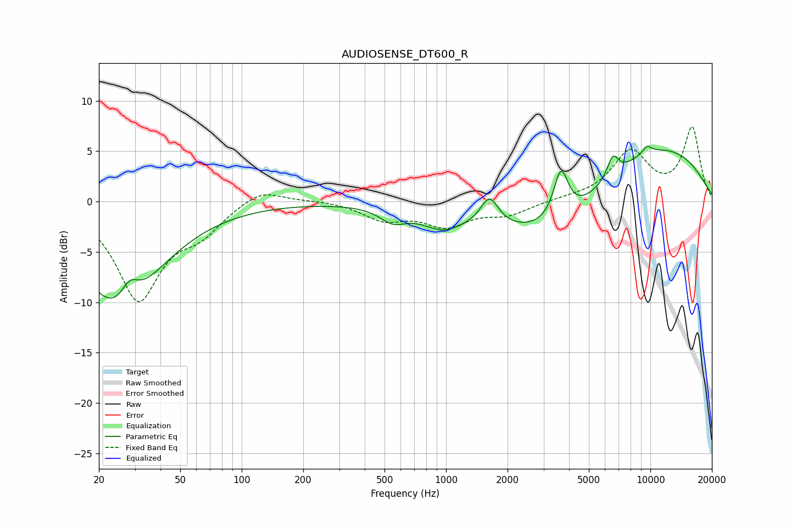

# AUDIOSENSE_DT600_R
See [usage instructions](https://github.com/jaakkopasanen/AutoEq#usage) for more options and info.

### Parametric EQs
Apply preamp of -5.6 dB when using parametric equalizer.

|   # | Type    |   Fc (Hz) |    Q |   Gain (dB) |
|-----|---------|-----------|------|-------------|
|   1 | Peaking |        25 | 0.73 |       -10.7 |
|   2 | Peaking |        28 | 3.14 |         2.4 |
|   3 | Peaking |       549 | 2.23 |        -1.4 |
|   4 | Peaking |       961 | 1.37 |        -1.9 |
|   5 | Peaking |      1632 | 3.29 |         2.7 |
|   6 | Peaking |      3441 | 0.5  |        -4.8 |
|   7 | Peaking |      3648 | 3.95 |         4.8 |
|   8 | Peaking |      6546 | 4.88 |         2.1 |
|   9 | Peaking |      9632 | 5.15 |         0.8 |
|  10 | Peaking |     10000 | 0.36 |         6.1 |

### Fixed Band EQs
When using fixed band (also called graphic) equalizer, apply preamp of **-7.5 dB** (if available) and set gains manually with these parameters.

|   # | Type    |   Fc (Hz) |    Q |   Gain (dB) |
|-----|---------|-----------|------|-------------|
|   1 | Peaking |        31 | 1.41 |        -9.5 |
|   2 | Peaking |        62 | 1.41 |        -2.4 |
|   3 | Peaking |       125 | 1.41 |         1.5 |
|   4 | Peaking |       250 | 1.41 |         0.2 |
|   5 | Peaking |       500 | 1.41 |        -1.7 |
|   6 | Peaking |      1000 | 1.41 |        -2.2 |
|   7 | Peaking |      2000 | 1.41 |        -1.2 |
|   8 | Peaking |      4000 | 1.41 |         0.2 |
|   9 | Peaking |      8000 | 1.41 |         4.8 |
|  10 | Peaking |     16000 | 1.41 |         7.2 |

### Graphs

