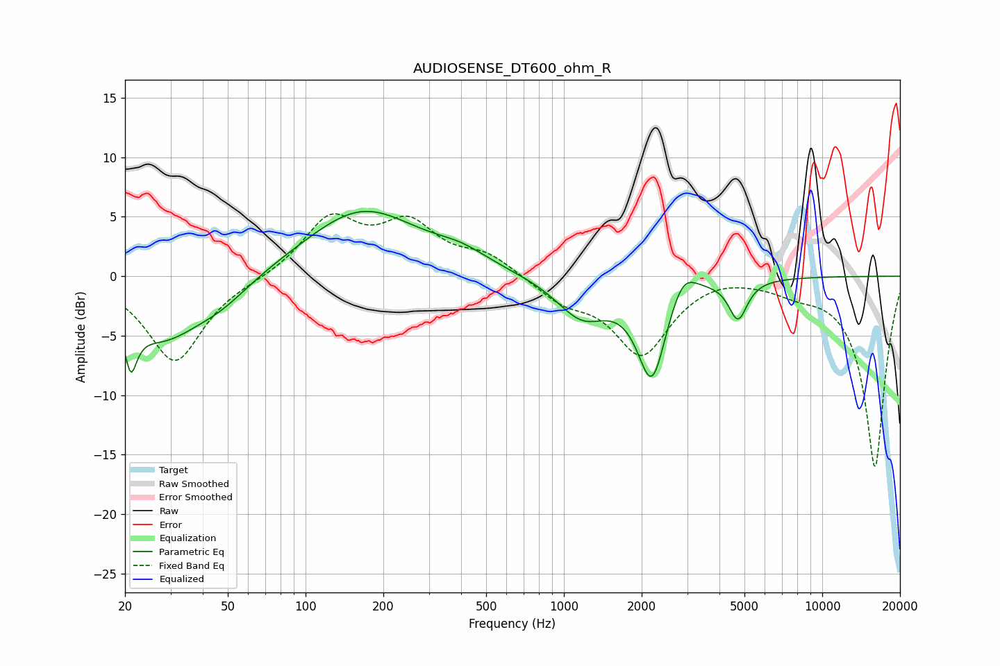

# AUDIOSENSE_DT600_ohm_R
See [usage instructions](https://github.com/jaakkopasanen/AutoEq#usage) for more options and info.

### Parametric EQs
Apply preamp of -5.6 dB when using parametric equalizer.

|   # | Type    |   Fc (Hz) |    Q |   Gain (dB) |
|-----|---------|-----------|------|-------------|
|   1 | Peaking |        21 | 5.94 |         3.2 |
|   2 | Peaking |        21 | 5.92 |        -7.3 |
|   3 | Peaking |        28 | 0.89 |        -5.1 |
|   4 | Peaking |        47 | 1.25 |        -1.4 |
|   5 | Peaking |       166 | 0.64 |         5.6 |
|   6 | Peaking |       402 | 1.38 |         1   |
|   7 | Peaking |      1176 | 1.4  |        -3.3 |
|   8 | Peaking |      2190 | 2.49 |        -8.4 |
|   9 | Peaking |      2882 | 2.71 |         2.4 |
|  10 | Peaking |      4720 | 3.96 |        -3.3 |

### Fixed Band EQs
When using fixed band (also called graphic) equalizer, apply preamp of **-5.3 dB** (if available) and set gains manually with these parameters.

|   # | Type    |   Fc (Hz) |    Q |   Gain (dB) |
|-----|---------|-----------|------|-------------|
|   1 | Peaking |        31 | 1.41 |        -7.2 |
|   2 | Peaking |        62 | 1.41 |        -0.2 |
|   3 | Peaking |       125 | 1.41 |         4.7 |
|   4 | Peaking |       250 | 1.41 |         4   |
|   5 | Peaking |       500 | 1.41 |         1.7 |
|   6 | Peaking |      1000 | 1.41 |        -1.8 |
|   7 | Peaking |      2000 | 1.41 |        -6.4 |
|   8 | Peaking |      4000 | 1.41 |         0.4 |
|   9 | Peaking |      8000 | 1.41 |        -0.8 |
|  10 | Peaking |     16000 | 1.41 |       -16.1 |

### Graphs

