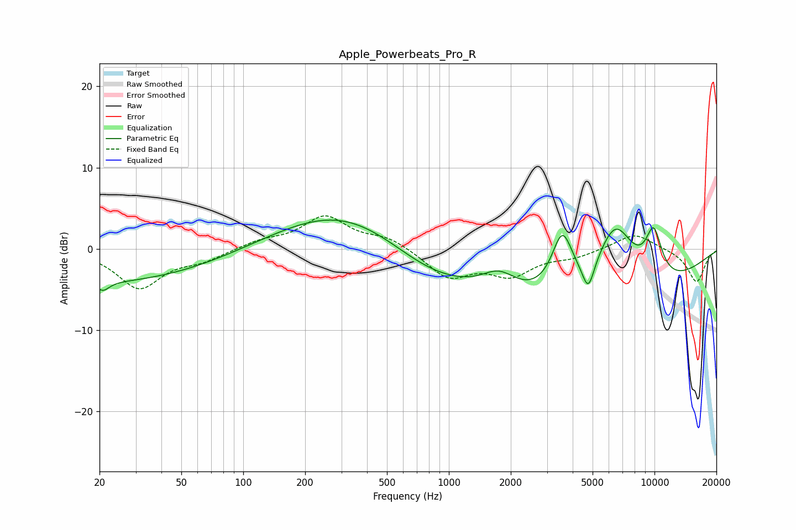

# Apple_Powerbeats_Pro_R
See [usage instructions](https://github.com/jaakkopasanen/AutoEq#usage) for more options and info.

### Parametric EQs
Apply preamp of -3.6 dB when using parametric equalizer.

|   # | Type    |   Fc (Hz) |    Q |   Gain (dB) |
|-----|---------|-----------|------|-------------|
|   1 | Peaking |        20 | 0.25 |        -4.1 |
|   2 | Peaking |        21 | 4.79 |        -1.1 |
|   3 | Peaking |       313 | 0.44 |         5.1 |
|   4 | Peaking |       774 | 0.64 |        -2.6 |
|   5 | Peaking |      1755 | 1.63 |         2.6 |
|   6 | Peaking |      3563 | 2.65 |         7.3 |
|   7 | Peaking |      4621 | 0.25 |        -8   |
|   8 | Peaking |      4765 | 4.9  |        -3.5 |
|   9 | Peaking |      6439 | 1.36 |         9.3 |
|  10 | Peaking |      9908 | 2.96 |         5.8 |

### Fixed Band EQs
When using fixed band (also called graphic) equalizer, apply preamp of **-4.2 dB** (if available) and set gains manually with these parameters.

|   # | Type    |   Fc (Hz) |    Q |   Gain (dB) |
|-----|---------|-----------|------|-------------|
|   1 | Peaking |        31 | 1.41 |        -4.7 |
|   2 | Peaking |        62 | 1.41 |        -1.2 |
|   3 | Peaking |       125 | 1.41 |         0.9 |
|   4 | Peaking |       250 | 1.41 |         3.9 |
|   5 | Peaking |       500 | 1.41 |         1.3 |
|   6 | Peaking |      1000 | 1.41 |        -3.4 |
|   7 | Peaking |      2000 | 1.41 |        -3   |
|   8 | Peaking |      4000 | 1.41 |        -0.8 |
|   9 | Peaking |      8000 | 1.41 |         2   |
|  10 | Peaking |     16000 | 1.41 |        -4.1 |

### Graphs

