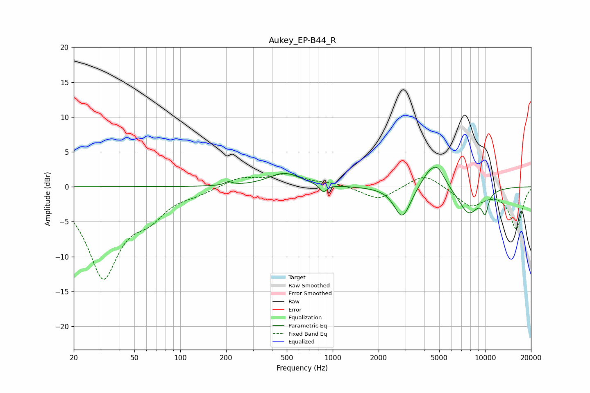

# Aukey_EP-B44_R
See [usage instructions](https://github.com/jaakkopasanen/AutoEq#usage) for more options and info.

### Parametric EQs
Apply preamp of -2.9 dB when using parametric equalizer.

|   # | Type    |   Fc (Hz) |    Q |   Gain (dB) |
|-----|---------|-----------|------|-------------|
|   1 | Peaking |       207 | 6    |         0.5 |
|   2 | Peaking |       484 | 1.37 |         1.9 |
|   3 | Peaking |       868 | 6    |        -1.1 |
|   4 | Peaking |      2845 | 2.83 |        -3.9 |
|   5 | Peaking |      3101 | 2    |        -0.8 |
|   6 | Peaking |      3945 | 2.06 |         1   |
|   7 | Peaking |      4267 | 4.54 |         0.6 |
|   8 | Peaking |      4851 | 2.67 |         3.1 |
|   9 | Peaking |      7811 | 1.93 |        -3.9 |
|  10 | Peaking |     10000 | 5.91 |        -2.7 |

### Fixed Band EQs
When using fixed band (also called graphic) equalizer, apply preamp of **-1.9 dB** (if available) and set gains manually with these parameters.

|   # | Type    |   Fc (Hz) |    Q |   Gain (dB) |
|-----|---------|-----------|------|-------------|
|   1 | Peaking |        31 | 1.41 |       -12.7 |
|   2 | Peaking |        62 | 1.41 |        -3   |
|   3 | Peaking |       125 | 1.41 |        -0.7 |
|   4 | Peaking |       250 | 1.41 |         1.3 |
|   5 | Peaking |       500 | 1.41 |         1.7 |
|   6 | Peaking |      1000 | 1.41 |         0.5 |
|   7 | Peaking |      2000 | 1.41 |        -1.9 |
|   8 | Peaking |      4000 | 1.41 |         2   |
|   9 | Peaking |      8000 | 1.41 |        -2.7 |
|  10 | Peaking |     16000 | 1.41 |        -5.9 |

### Graphs

