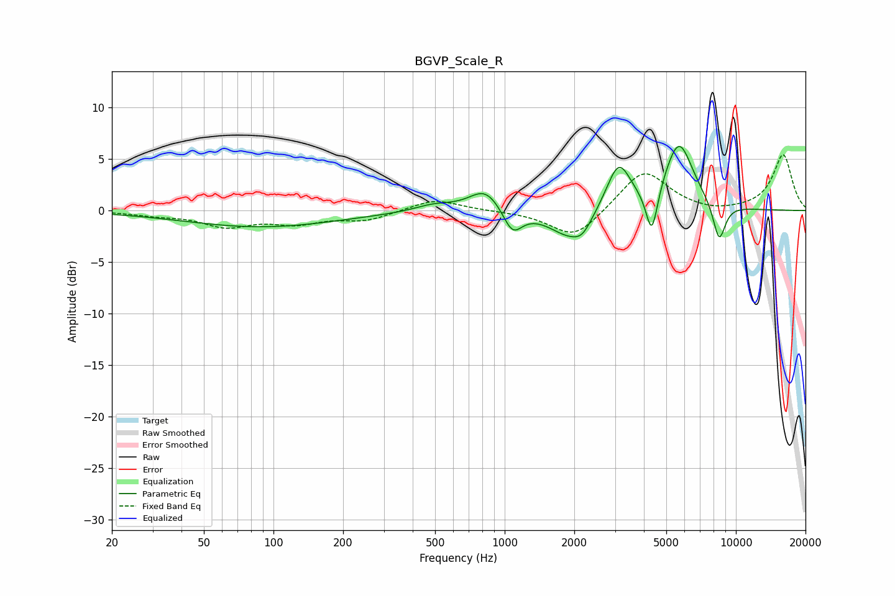

# BGVP_Scale_R
See [usage instructions](https://github.com/jaakkopasanen/AutoEq#usage) for more options and info.

### Parametric EQs
Apply preamp of -6.3 dB when using parametric equalizer.

|   # | Type    |   Fc (Hz) |    Q |   Gain (dB) |
|-----|---------|-----------|------|-------------|
|   1 | Peaking |        88 | 0.43 |        -1.6 |
|   2 | Peaking |       494 | 1.66 |         0.6 |
|   3 | Peaking |       826 | 2.04 |         2.2 |
|   4 | Peaking |      1081 | 3.43 |        -2.4 |
|   5 | Peaking |      1912 | 1.56 |        -2.6 |
|   6 | Peaking |      2170 | 3.58 |        -1.1 |
|   7 | Peaking |      3109 | 2.65 |         4.6 |
|   8 | Peaking |      4329 | 5.53 |        -4.7 |
|   9 | Peaking |      5667 | 2.17 |         6.6 |
|  10 | Peaking |      8463 | 4.78 |        -3.8 |

### Fixed Band EQs
When using fixed band (also called graphic) equalizer, apply preamp of **-5.5 dB** (if available) and set gains manually with these parameters.

|   # | Type    |   Fc (Hz) |    Q |   Gain (dB) |
|-----|---------|-----------|------|-------------|
|   1 | Peaking |        31 | 1.41 |        -0.4 |
|   2 | Peaking |        62 | 1.41 |        -1.4 |
|   3 | Peaking |       125 | 1.41 |        -1.1 |
|   4 | Peaking |       250 | 1.41 |        -0.9 |
|   5 | Peaking |       500 | 1.41 |         1.2 |
|   6 | Peaking |      1000 | 1.41 |        -0   |
|   7 | Peaking |      2000 | 1.41 |        -2.8 |
|   8 | Peaking |      4000 | 1.41 |         4   |
|   9 | Peaking |      8000 | 1.41 |        -0.3 |
|  10 | Peaking |     16000 | 1.41 |         5.4 |

### Graphs

