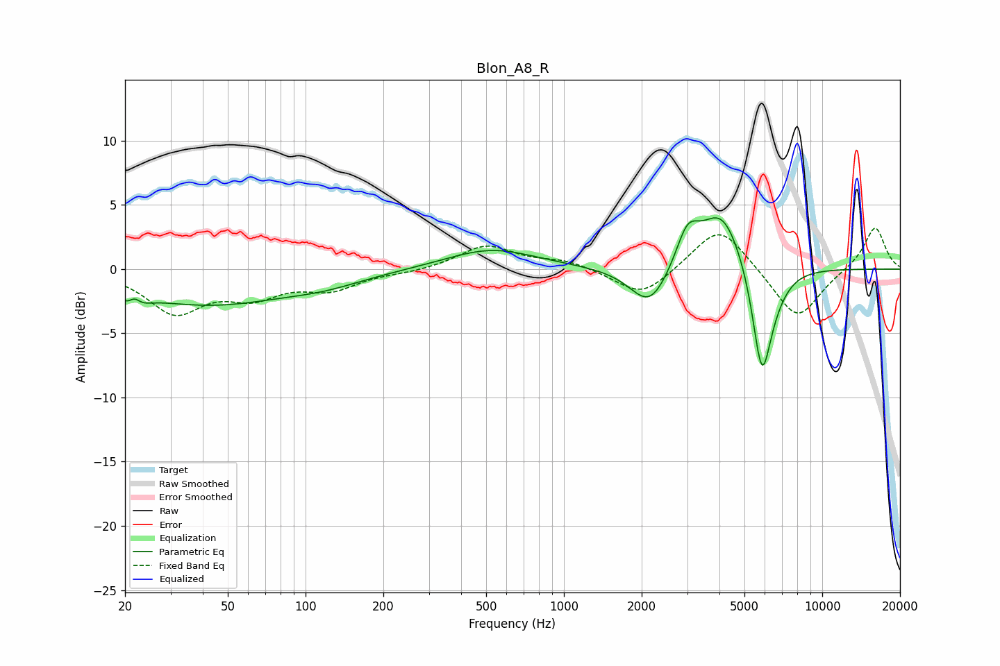

# Blon_A8_R
See [usage instructions](https://github.com/jaakkopasanen/AutoEq#usage) for more options and info.

### Parametric EQs
Apply preamp of -4.1 dB when using parametric equalizer.

|   # | Type    |   Fc (Hz) |    Q |   Gain (dB) |
|-----|---------|-----------|------|-------------|
|   1 | Peaking |        22 | 3.89 |        -2.6 |
|   2 | Peaking |        22 | 5.36 |         2.2 |
|   3 | Peaking |        42 | 0.46 |        -2.7 |
|   4 | Peaking |       120 | 0.9  |        -0.7 |
|   5 | Peaking |       523 | 0.81 |         1.6 |
|   6 | Peaking |      2152 | 1.85 |        -3.3 |
|   7 | Peaking |      3007 | 3.21 |         2.7 |
|   8 | Peaking |      4083 | 1.64 |         4.8 |
|   9 | Peaking |      5838 | 3.69 |        -8.4 |
|  10 | Peaking |      6525 | 2.35 |        -1.2 |

### Fixed Band EQs
When using fixed band (also called graphic) equalizer, apply preamp of **-3.3 dB** (if available) and set gains manually with these parameters.

|   # | Type    |   Fc (Hz) |    Q |   Gain (dB) |
|-----|---------|-----------|------|-------------|
|   1 | Peaking |        31 | 1.41 |        -3.2 |
|   2 | Peaking |        62 | 1.41 |        -1.8 |
|   3 | Peaking |       125 | 1.41 |        -1.4 |
|   4 | Peaking |       250 | 1.41 |        -0.2 |
|   5 | Peaking |       500 | 1.41 |         1.8 |
|   6 | Peaking |      1000 | 1.41 |         0.6 |
|   7 | Peaking |      2000 | 1.41 |        -2.3 |
|   8 | Peaking |      4000 | 1.41 |         3.6 |
|   9 | Peaking |      8000 | 1.41 |        -4.1 |
|  10 | Peaking |     16000 | 1.41 |         3.4 |

### Graphs

