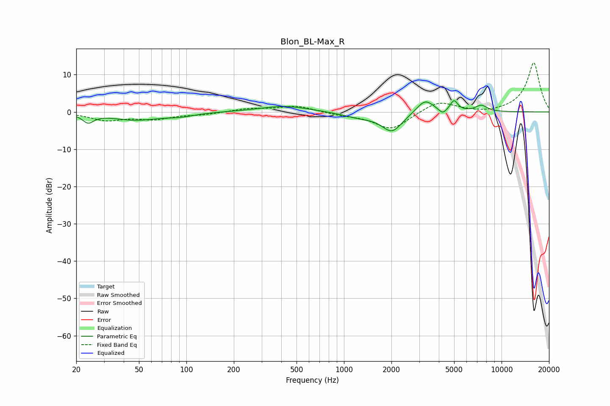

# Blon_BL-Max_R
See [usage instructions](https://github.com/jaakkopasanen/AutoEq#usage) for more options and info.

### Parametric EQs
Apply preamp of -3.1 dB when using parametric equalizer.

|   # | Type    |   Fc (Hz) |    Q |   Gain (dB) |
|-----|---------|-----------|------|-------------|
|   1 | Peaking |        24 | 4.01 |        -2.3 |
|   2 | Peaking |        47 | 0.94 |        -2.1 |
|   3 | Peaking |        91 | 1.59 |        -0.8 |
|   4 | Peaking |       418 | 0.92 |         1.6 |
|   5 | Peaking |      1241 | 1.34 |        -1.3 |
|   6 | Peaking |      2017 | 2.14 |        -5.1 |
|   7 | Peaking |      3269 | 2.6  |         3.6 |
|   8 | Peaking |      4227 | 6    |        -1.4 |
|   9 | Peaking |      4993 | 5.98 |         2.9 |
|  10 | Peaking |      7435 | 3.54 |         1.7 |

### Fixed Band EQs
When using fixed band (also called graphic) equalizer, apply preamp of **-13.2 dB** (if available) and set gains manually with these parameters.

|   # | Type    |   Fc (Hz) |    Q |   Gain (dB) |
|-----|---------|-----------|------|-------------|
|   1 | Peaking |        31 | 1.41 |        -2.1 |
|   2 | Peaking |        62 | 1.41 |        -1.7 |
|   3 | Peaking |       125 | 1.41 |        -0.6 |
|   4 | Peaking |       250 | 1.41 |         0.9 |
|   5 | Peaking |       500 | 1.41 |         1.6 |
|   6 | Peaking |      1000 | 1.41 |        -0.7 |
|   7 | Peaking |      2000 | 1.41 |        -4.8 |
|   8 | Peaking |      4000 | 1.41 |         3   |
|   9 | Peaking |      8000 | 1.41 |        -0.4 |
|  10 | Peaking |     16000 | 1.41 |        13.3 |

### Graphs

