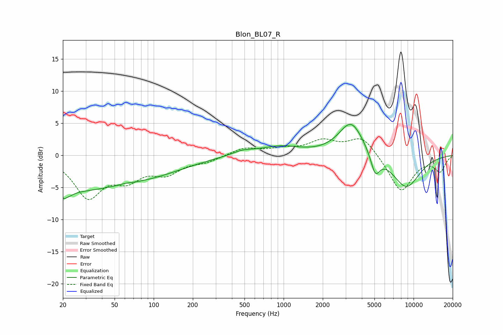

# Blon_BL07_R
See [usage instructions](https://github.com/jaakkopasanen/AutoEq#usage) for more options and info.

### Parametric EQs
Apply preamp of -4.9 dB when using parametric equalizer.

|   # | Type    |   Fc (Hz) |    Q |   Gain (dB) |
|-----|---------|-----------|------|-------------|
|   1 | Peaking |        20 | 0.28 |        -5.4 |
|   2 | Peaking |        21 | 5.11 |        -4.3 |
|   3 | Peaking |        21 | 5.89 |         3.2 |
|   4 | Peaking |        60 | 3.2  |         0.2 |
|   5 | Peaking |       110 | 0.55 |        -1.6 |
|   6 | Peaking |       484 | 1.58 |         0.7 |
|   7 | Peaking |       945 | 0.94 |         1.3 |
|   8 | Peaking |      3311 | 1.48 |         5.4 |
|   9 | Peaking |      5073 | 3.99 |        -3.2 |
|  10 | Peaking |      8761 | 1.18 |        -5.1 |

### Fixed Band EQs
When using fixed band (also called graphic) equalizer, apply preamp of **-2.7 dB** (if available) and set gains manually with these parameters.

|   # | Type    |   Fc (Hz) |    Q |   Gain (dB) |
|-----|---------|-----------|------|-------------|
|   1 | Peaking |        31 | 1.41 |        -6.2 |
|   2 | Peaking |        62 | 1.41 |        -3.1 |
|   3 | Peaking |       125 | 1.41 |        -2.4 |
|   4 | Peaking |       250 | 1.41 |        -0.8 |
|   5 | Peaking |       500 | 1.41 |         1.2 |
|   6 | Peaking |      1000 | 1.41 |         0.8 |
|   7 | Peaking |      2000 | 1.41 |         2.1 |
|   8 | Peaking |      4000 | 1.41 |         3   |
|   9 | Peaking |      8000 | 1.41 |        -5.7 |
|  10 | Peaking |     16000 | 1.41 |        -2.4 |

### Graphs

