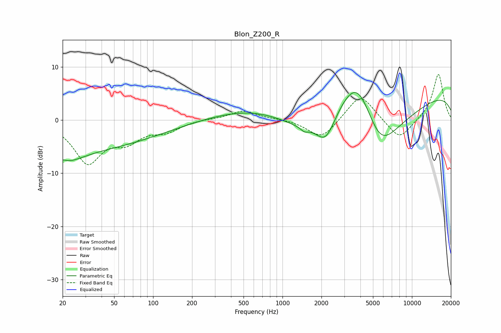

# Blon_Z200_R
See [usage instructions](https://github.com/jaakkopasanen/AutoEq#usage) for more options and info.

### Parametric EQs
Apply preamp of -5.3 dB when using parametric equalizer.

|   # | Type    |   Fc (Hz) |    Q |   Gain (dB) |
|-----|---------|-----------|------|-------------|
|   1 | Peaking |        20 | 0.99 |        -2.6 |
|   2 | Peaking |        20 | 5.12 |         0.5 |
|   3 | Peaking |        23 | 0.19 |        -5.4 |
|   4 | Peaking |       942 | 0.33 |         3.4 |
|   5 | Peaking |      1474 | 5.13 |        -0.7 |
|   6 | Peaking |      1561 | 0.6  |        -5.4 |
|   7 | Peaking |      2163 | 1.9  |        -5.1 |
|   8 | Peaking |      3808 | 0.84 |        12.8 |
|   9 | Peaking |      5603 | 0.69 |       -15.3 |
|  10 | Peaking |     10000 | 0.18 |         5.8 |

### Fixed Band EQs
When using fixed band (also called graphic) equalizer, apply preamp of **-8.7 dB** (if available) and set gains manually with these parameters.

|   # | Type    |   Fc (Hz) |    Q |   Gain (dB) |
|-----|---------|-----------|------|-------------|
|   1 | Peaking |        31 | 1.41 |        -7.7 |
|   2 | Peaking |        62 | 1.41 |        -3.2 |
|   3 | Peaking |       125 | 1.41 |        -1.8 |
|   4 | Peaking |       250 | 1.41 |         0.2 |
|   5 | Peaking |       500 | 1.41 |         1.8 |
|   6 | Peaking |      1000 | 1.41 |         0.2 |
|   7 | Peaking |      2000 | 1.41 |        -3.6 |
|   8 | Peaking |      4000 | 1.41 |         5.1 |
|   9 | Peaking |      8000 | 1.41 |        -3.9 |
|  10 | Peaking |     16000 | 1.41 |         8.8 |

### Graphs

