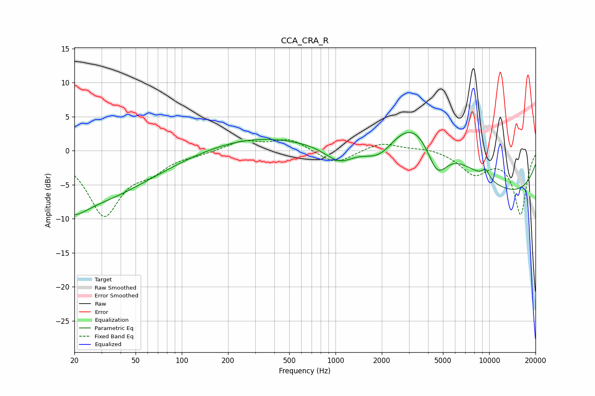

# CCA_CRA_R
See [usage instructions](https://github.com/jaakkopasanen/AutoEq#usage) for more options and info.

### Parametric EQs
Apply preamp of -2.8 dB when using parametric equalizer.

|   # | Type    |   Fc (Hz) |    Q |   Gain (dB) |
|-----|---------|-----------|------|-------------|
|   1 | Peaking |        20 | 1.91 |        -1.5 |
|   2 | Peaking |        20 | 0.28 |        -9.2 |
|   3 | Peaking |        33 | 0.19 |         1.3 |
|   4 | Peaking |       311 | 0.48 |         1.8 |
|   5 | Peaking |      1067 | 1.35 |        -3.1 |
|   6 | Peaking |      1934 | 1.23 |        -4.2 |
|   7 | Peaking |      3499 | 0.5  |        11.1 |
|   8 | Peaking |      4567 | 1.91 |        -6.1 |
|   9 | Peaking |      9480 | 5.14 |         1.3 |
|  10 | Peaking |      9981 | 0.22 |        -7.5 |

### Fixed Band EQs
When using fixed band (also called graphic) equalizer, apply preamp of **-1.7 dB** (if available) and set gains manually with these parameters.

|   # | Type    |   Fc (Hz) |    Q |   Gain (dB) |
|-----|---------|-----------|------|-------------|
|   1 | Peaking |        31 | 1.41 |        -9.3 |
|   2 | Peaking |        62 | 1.41 |        -2.2 |
|   3 | Peaking |       125 | 1.41 |        -0.4 |
|   4 | Peaking |       250 | 1.41 |         1.4 |
|   5 | Peaking |       500 | 1.41 |         1.7 |
|   6 | Peaking |      1000 | 1.41 |        -2.1 |
|   7 | Peaking |      2000 | 1.41 |         1.3 |
|   8 | Peaking |      4000 | 1.41 |         0.4 |
|   9 | Peaking |      8000 | 1.41 |        -3.2 |
|  10 | Peaking |     16000 | 1.41 |        -9.3 |

### Graphs

