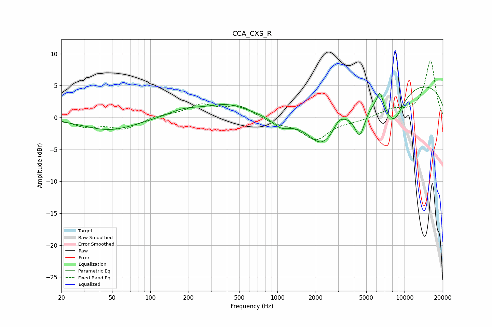

# CCA_CXS_R
See [usage instructions](https://github.com/jaakkopasanen/AutoEq#usage) for more options and info.

### Parametric EQs
Apply preamp of -4.9 dB when using parametric equalizer.

|   # | Type    |   Fc (Hz) |    Q |   Gain (dB) |
|-----|---------|-----------|------|-------------|
|   1 | Peaking |        48 | 0.68 |        -2   |
|   2 | Peaking |       183 | 1.11 |         1.1 |
|   3 | Peaking |       404 | 0.82 |         1.9 |
|   4 | Peaking |      1073 | 1.93 |        -1.6 |
|   5 | Peaking |      2275 | 1.11 |        -6.5 |
|   6 | Peaking |      3042 | 3.9  |         1   |
|   7 | Peaking |      4445 | 3.13 |        -5.1 |
|   8 | Peaking |      6405 | 5.78 |         2.5 |
|   9 | Peaking |      8213 | 1.61 |        -5.4 |
|  10 | Peaking |     10000 | 0.19 |         5.7 |

### Fixed Band EQs
When using fixed band (also called graphic) equalizer, apply preamp of **-9.0 dB** (if available) and set gains manually with these parameters.

|   # | Type    |   Fc (Hz) |    Q |   Gain (dB) |
|-----|---------|-----------|------|-------------|
|   1 | Peaking |        31 | 1.41 |        -1.3 |
|   2 | Peaking |        62 | 1.41 |        -1.7 |
|   3 | Peaking |       125 | 1.41 |         0.3 |
|   4 | Peaking |       250 | 1.41 |         1.9 |
|   5 | Peaking |       500 | 1.41 |         1.7 |
|   6 | Peaking |      1000 | 1.41 |        -0.9 |
|   7 | Peaking |      2000 | 1.41 |        -3.4 |
|   8 | Peaking |      4000 | 1.41 |        -0.4 |
|   9 | Peaking |      8000 | 1.41 |         1.1 |
|  10 | Peaking |     16000 | 1.41 |         8.9 |

### Graphs

