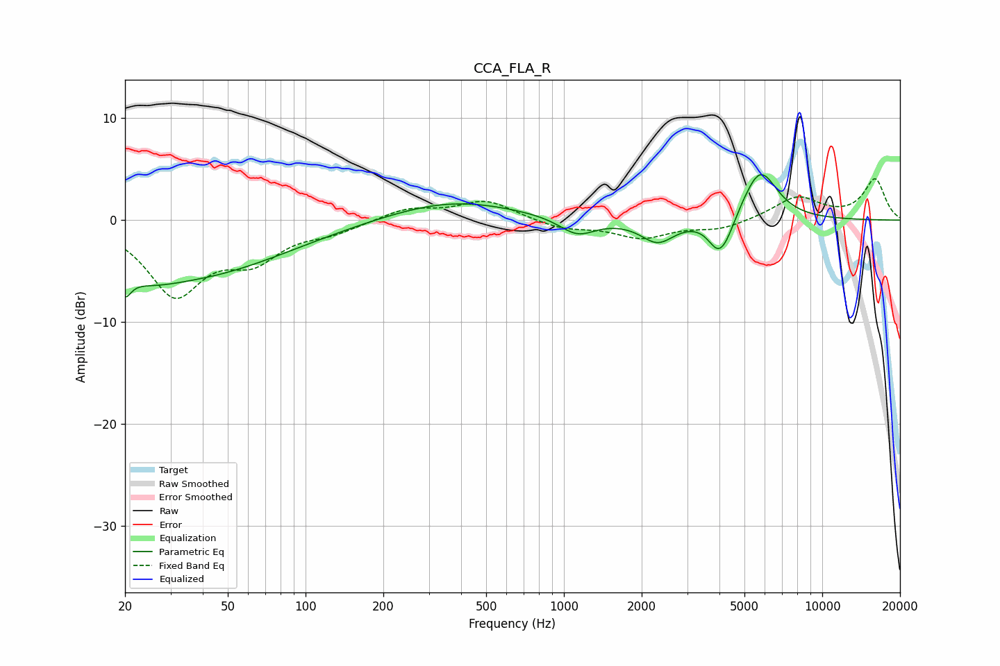

# CCA_FLA_R
See [usage instructions](https://github.com/jaakkopasanen/AutoEq#usage) for more options and info.

### Parametric EQs
Apply preamp of -4.6 dB when using parametric equalizer.

|   # | Type    |   Fc (Hz) |    Q |   Gain (dB) |
|-----|---------|-----------|------|-------------|
|   1 | Peaking |        20 | 5.87 |        -5.5 |
|   2 | Peaking |        20 | 5.91 |         3.2 |
|   3 | Peaking |        24 | 1.22 |        -1.4 |
|   4 | Peaking |        36 | 0.39 |        -5.2 |
|   5 | Peaking |       369 | 0.56 |         2   |
|   6 | Peaking |      1127 | 2.02 |        -1.7 |
|   7 | Peaking |      2308 | 2.17 |        -2.2 |
|   8 | Peaking |      3957 | 3.41 |        -2.9 |
|   9 | Peaking |      4287 | 3.67 |        -1.3 |
|  10 | Peaking |      5746 | 2.06 |         5   |

### Fixed Band EQs
When using fixed band (also called graphic) equalizer, apply preamp of **-4.1 dB** (if available) and set gains manually with these parameters.

|   # | Type    |   Fc (Hz) |    Q |   Gain (dB) |
|-----|---------|-----------|------|-------------|
|   1 | Peaking |        31 | 1.41 |        -7   |
|   2 | Peaking |        62 | 1.41 |        -3.3 |
|   3 | Peaking |       125 | 1.41 |        -1   |
|   4 | Peaking |       250 | 1.41 |         1.2 |
|   5 | Peaking |       500 | 1.41 |         1.9 |
|   6 | Peaking |      1000 | 1.41 |        -0.8 |
|   7 | Peaking |      2000 | 1.41 |        -1.7 |
|   8 | Peaking |      4000 | 1.41 |        -0.9 |
|   9 | Peaking |      8000 | 1.41 |         2.2 |
|  10 | Peaking |     16000 | 1.41 |         4   |

### Graphs

