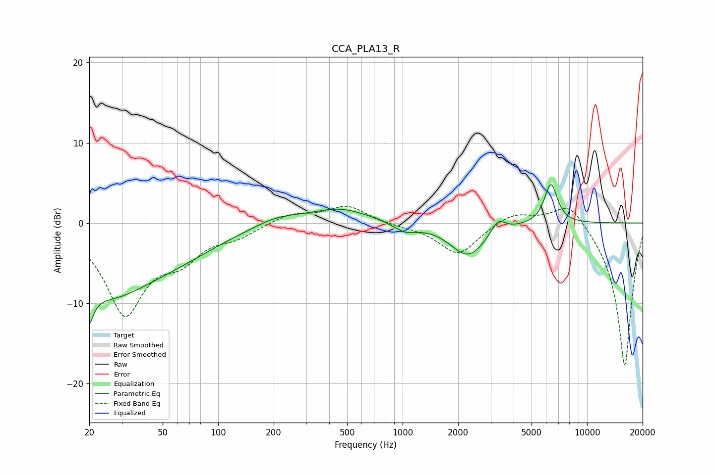

# CCA_PLA13_R
See [usage instructions](https://github.com/jaakkopasanen/AutoEq#usage) for more options and info.

### Parametric EQs
Apply preamp of -4.9 dB when using parametric equalizer.

|   # | Type    |   Fc (Hz) |    Q |   Gain (dB) |
|-----|---------|-----------|------|-------------|
|   1 | Peaking |        20 | 6    |         6.1 |
|   2 | Peaking |        20 | 5.84 |       -10.5 |
|   3 | Peaking |        25 | 0.57 |        -8.2 |
|   4 | Peaking |        63 | 0.6  |        -2.1 |
|   5 | Peaking |       210 | 1.14 |         1   |
|   6 | Peaking |       456 | 0.89 |         1.8 |
|   7 | Peaking |      1030 | 2.23 |        -1.1 |
|   8 | Peaking |      2268 | 1.46 |        -4.1 |
|   9 | Peaking |      3292 | 3.64 |         1.7 |
|  10 | Peaking |      6366 | 3.88 |         5   |

### Fixed Band EQs
When using fixed band (also called graphic) equalizer, apply preamp of **-2.2 dB** (if available) and set gains manually with these parameters.

|   # | Type    |   Fc (Hz) |    Q |   Gain (dB) |
|-----|---------|-----------|------|-------------|
|   1 | Peaking |        31 | 1.41 |       -11   |
|   2 | Peaking |        62 | 1.41 |        -3.4 |
|   3 | Peaking |       125 | 1.41 |        -1.4 |
|   4 | Peaking |       250 | 1.41 |         1.2 |
|   5 | Peaking |       500 | 1.41 |         2.1 |
|   6 | Peaking |      1000 | 1.41 |        -0.3 |
|   7 | Peaking |      2000 | 1.41 |        -4   |
|   8 | Peaking |      4000 | 1.41 |         1.4 |
|   9 | Peaking |      8000 | 1.41 |         3.1 |
|  10 | Peaking |     16000 | 1.41 |       -18   |

### Graphs

