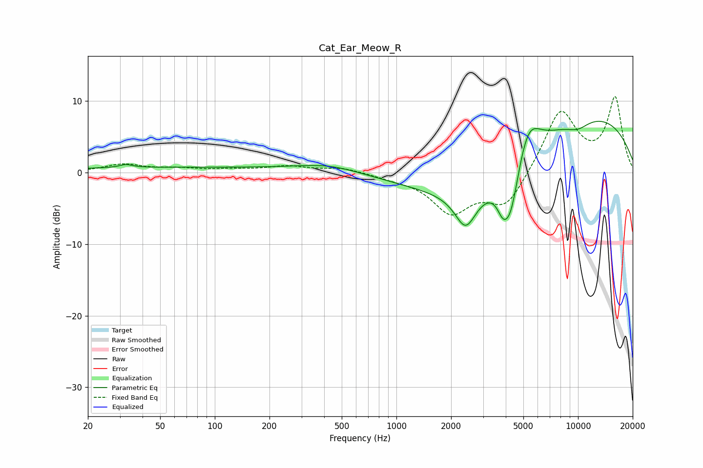

# Cat_Ear_Meow_R
See [usage instructions](https://github.com/jaakkopasanen/AutoEq#usage) for more options and info.

### Parametric EQs
Apply preamp of -7.3 dB when using parametric equalizer.

|   # | Type    |   Fc (Hz) |    Q |   Gain (dB) |
|-----|---------|-----------|------|-------------|
|   1 | Peaking |        32 | 4.23 |         0.4 |
|   2 | Peaking |        60 | 0.18 |         0.7 |
|   3 | Peaking |       433 | 0.78 |         1.2 |
|   4 | Peaking |      2405 | 2.45 |        -4.8 |
|   5 | Peaking |      2744 | 0.4  |       -10.2 |
|   6 | Peaking |      3856 | 4.36 |        -2.5 |
|   7 | Peaking |      4255 | 2.89 |        -7.1 |
|   8 | Peaking |      5303 | 2.12 |         5.3 |
|   9 | Peaking |      7062 | 0.19 |        10.4 |
|  10 | Peaking |      9973 | 1.87 |        -1.2 |

### Fixed Band EQs
When using fixed band (also called graphic) equalizer, apply preamp of **-10.7 dB** (if available) and set gains manually with these parameters.

|   # | Type    |   Fc (Hz) |    Q |   Gain (dB) |
|-----|---------|-----------|------|-------------|
|   1 | Peaking |        31 | 1.41 |         1.1 |
|   2 | Peaking |        62 | 1.41 |         0.5 |
|   3 | Peaking |       125 | 1.41 |         0.3 |
|   4 | Peaking |       250 | 1.41 |         0.8 |
|   5 | Peaking |       500 | 1.41 |         0.7 |
|   6 | Peaking |      1000 | 1.41 |        -0.6 |
|   7 | Peaking |      2000 | 1.41 |        -5.3 |
|   8 | Peaking |      4000 | 1.41 |        -4.8 |
|   9 | Peaking |      8000 | 1.41 |         8.8 |
|  10 | Peaking |     16000 | 1.41 |        10.2 |

### Graphs

