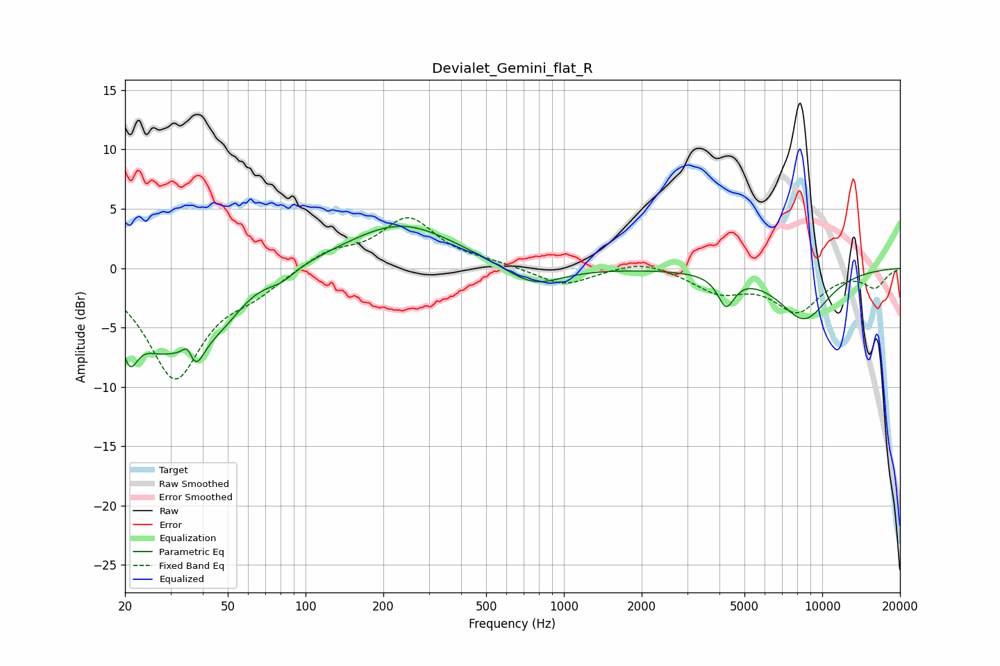

# Devialet_Gemini_flat_R
See [usage instructions](https://github.com/jaakkopasanen/AutoEq#usage) for more options and info.

### Parametric EQs
Apply preamp of -3.6 dB when using parametric equalizer.

|   # | Type    |   Fc (Hz) |    Q |   Gain (dB) |
|-----|---------|-----------|------|-------------|
|   1 | Peaking |        21 | 4.04 |        -4.5 |
|   2 | Peaking |        27 | 1.42 |        -5.1 |
|   3 | Peaking |        35 | 5.77 |         3   |
|   4 | Peaking |        36 | 3.48 |        -5.2 |
|   5 | Peaking |        47 | 1.51 |        -3.1 |
|   6 | Peaking |        80 | 2.62 |        -0.9 |
|   7 | Peaking |       234 | 0.68 |         3.8 |
|   8 | Peaking |       760 | 1.29 |        -1.8 |
|   9 | Peaking |      4246 | 4.38 |        -2.6 |
|  10 | Peaking |      8497 | 1.32 |        -4.2 |

### Fixed Band EQs
When using fixed band (also called graphic) equalizer, apply preamp of **-4.3 dB** (if available) and set gains manually with these parameters.

|   # | Type    |   Fc (Hz) |    Q |   Gain (dB) |
|-----|---------|-----------|------|-------------|
|   1 | Peaking |        31 | 1.41 |        -9.2 |
|   2 | Peaking |        62 | 1.41 |        -1.5 |
|   3 | Peaking |       125 | 1.41 |         1.4 |
|   4 | Peaking |       250 | 1.41 |         4.1 |
|   5 | Peaking |       500 | 1.41 |         0.4 |
|   6 | Peaking |      1000 | 1.41 |        -1.5 |
|   7 | Peaking |      2000 | 1.41 |         0.8 |
|   8 | Peaking |      4000 | 1.41 |        -1.8 |
|   9 | Peaking |      8000 | 1.41 |        -3.4 |
|  10 | Peaking |     16000 | 1.41 |        -1.5 |

### Graphs

