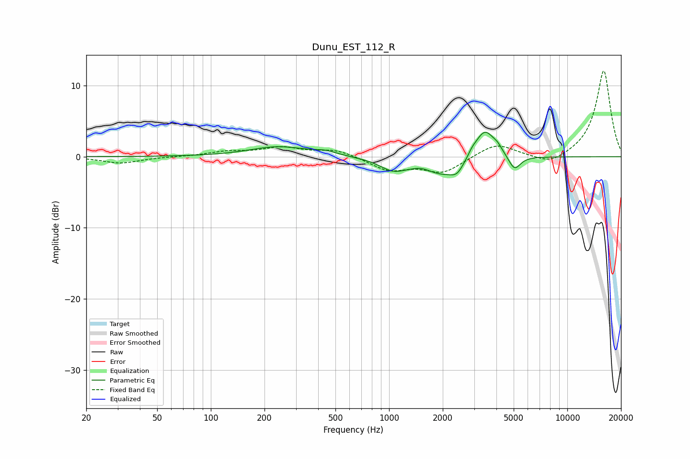

# Dunu_EST_112_R
See [usage instructions](https://github.com/jaakkopasanen/AutoEq#usage) for more options and info.

### Parametric EQs
Apply preamp of -3.5 dB when using parametric equalizer.

|   # | Type    |   Fc (Hz) |    Q |   Gain (dB) |
|-----|---------|-----------|------|-------------|
|   1 | Peaking |       238 | 0.89 |         1.4 |
|   2 | Peaking |       439 | 2.15 |         0.5 |
|   3 | Peaking |      1050 | 1.96 |        -1.5 |
|   4 | Peaking |      1531 | 2.97 |         0.5 |
|   5 | Peaking |      2099 | 1.02 |        -2.8 |
|   6 | Peaking |      2400 | 4.45 |        -0.9 |
|   7 | Peaking |      2913 | 5.42 |         0.7 |
|   8 | Peaking |      3437 | 2.39 |         4.7 |
|   9 | Peaking |      4072 | 6    |         0.6 |
|  10 | Peaking |      5054 | 4.28 |        -2   |

### Fixed Band EQs
When using fixed band (also called graphic) equalizer, apply preamp of **-12.1 dB** (if available) and set gains manually with these parameters.

|   # | Type    |   Fc (Hz) |    Q |   Gain (dB) |
|-----|---------|-----------|------|-------------|
|   1 | Peaking |        31 | 1.41 |        -0.9 |
|   2 | Peaking |        62 | 1.41 |        -0   |
|   3 | Peaking |       125 | 1.41 |         0.6 |
|   4 | Peaking |       250 | 1.41 |         1.2 |
|   5 | Peaking |       500 | 1.41 |         1   |
|   6 | Peaking |      1000 | 1.41 |        -1.9 |
|   7 | Peaking |      2000 | 1.41 |        -2.2 |
|   8 | Peaking |      4000 | 1.41 |         1.9 |
|   9 | Peaking |      8000 | 1.41 |        -1.3 |
|  10 | Peaking |     16000 | 1.41 |        12.2 |

### Graphs

