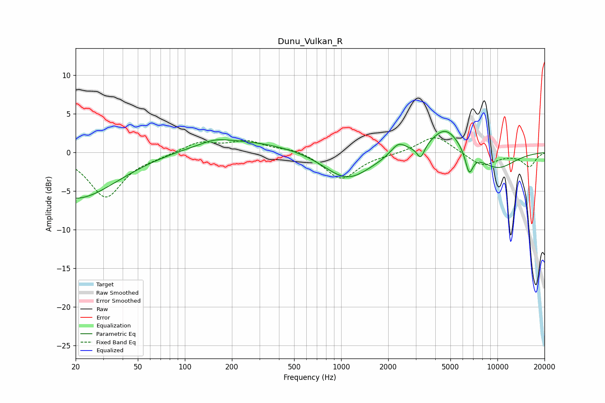

# Dunu_Vulkan_R
See [usage instructions](https://github.com/jaakkopasanen/AutoEq#usage) for more options and info.

### Parametric EQs
Apply preamp of -2.8 dB when using parametric equalizer.

|   # | Type    |   Fc (Hz) |    Q |   Gain (dB) |
|-----|---------|-----------|------|-------------|
|   1 | Peaking |        20 | 0.54 |        -6   |
|   2 | Peaking |       156 | 1.69 |         0.5 |
|   3 | Peaking |       237 | 0.41 |         1.7 |
|   4 | Peaking |       346 | 0.77 |        -0.2 |
|   5 | Peaking |      1090 | 0.95 |        -3.7 |
|   6 | Peaking |      2325 | 2.83 |         1.6 |
|   7 | Peaking |      3228 | 5.91 |        -1.7 |
|   8 | Peaking |      4649 | 1.45 |         3.5 |
|   9 | Peaking |      6595 | 5.49 |        -2.9 |
|  10 | Peaking |      9897 | 0.99 |        -2.2 |

### Fixed Band EQs
When using fixed band (also called graphic) equalizer, apply preamp of **-2.0 dB** (if available) and set gains manually with these parameters.

|   # | Type    |   Fc (Hz) |    Q |   Gain (dB) |
|-----|---------|-----------|------|-------------|
|   1 | Peaking |        31 | 1.41 |        -5.7 |
|   2 | Peaking |        62 | 1.41 |        -0.4 |
|   3 | Peaking |       125 | 1.41 |         1.4 |
|   4 | Peaking |       250 | 1.41 |         1.4 |
|   5 | Peaking |       500 | 1.41 |         0.5 |
|   6 | Peaking |      1000 | 1.41 |        -3.5 |
|   7 | Peaking |      2000 | 1.41 |        -0.2 |
|   8 | Peaking |      4000 | 1.41 |         2.3 |
|   9 | Peaking |      8000 | 1.41 |        -1.8 |
|  10 | Peaking |     16000 | 1.41 |        -1.8 |

### Graphs

