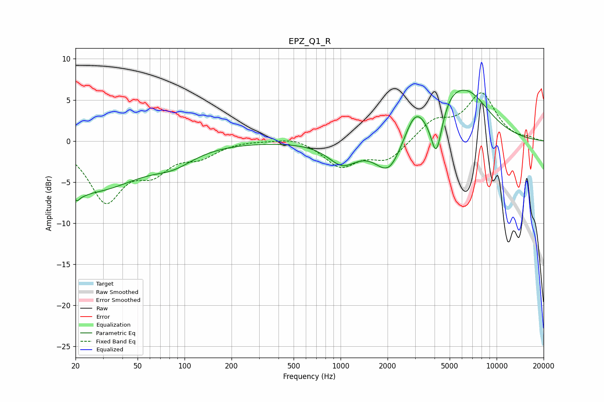

# EPZ_Q1_R
See [usage instructions](https://github.com/jaakkopasanen/AutoEq#usage) for more options and info.

### Parametric EQs
Apply preamp of -6.3 dB when using parametric equalizer.

|   # | Type    |   Fc (Hz) |    Q |   Gain (dB) |
|-----|---------|-----------|------|-------------|
|   1 | Peaking |        21 | 5.15 |        -4.6 |
|   2 | Peaking |        21 | 5.8  |         3.3 |
|   3 | Peaking |        25 | 0.45 |        -5.9 |
|   4 | Peaking |        85 | 1.1  |        -1.5 |
|   5 | Peaking |      1027 | 1.53 |        -2.6 |
|   6 | Peaking |      2044 | 1.65 |        -4.2 |
|   7 | Peaking |      3002 | 2.09 |         3.5 |
|   8 | Peaking |      4107 | 4.05 |        -5.3 |
|   9 | Peaking |      5080 | 1.76 |         2.1 |
|  10 | Peaking |      6592 | 0.95 |         5.3 |

### Fixed Band EQs
When using fixed band (also called graphic) equalizer, apply preamp of **-5.9 dB** (if available) and set gains manually with these parameters.

|   # | Type    |   Fc (Hz) |    Q |   Gain (dB) |
|-----|---------|-----------|------|-------------|
|   1 | Peaking |        31 | 1.41 |        -7   |
|   2 | Peaking |        62 | 1.41 |        -3.1 |
|   3 | Peaking |       125 | 1.41 |        -1.6 |
|   4 | Peaking |       250 | 1.41 |         0.1 |
|   5 | Peaking |       500 | 1.41 |         0.6 |
|   6 | Peaking |      1000 | 1.41 |        -3   |
|   7 | Peaking |      2000 | 1.41 |        -2.3 |
|   8 | Peaking |      4000 | 1.41 |         2.3 |
|   9 | Peaking |      8000 | 1.41 |         5.6 |
|  10 | Peaking |     16000 | 1.41 |         0.3 |

### Graphs

