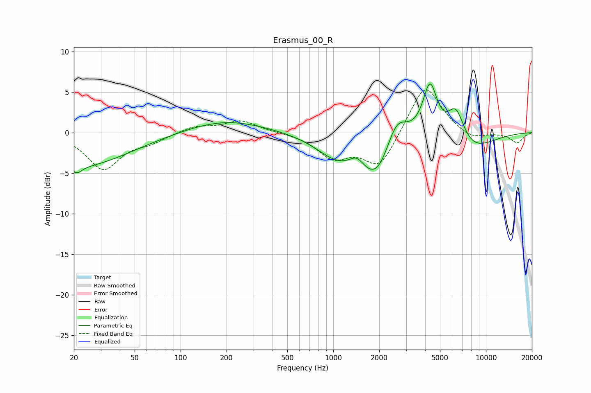

# Erasmus_00_R
See [usage instructions](https://github.com/jaakkopasanen/AutoEq#usage) for more options and info.

### Parametric EQs
Apply preamp of -6.1 dB when using parametric equalizer.

|   # | Type    |   Fc (Hz) |    Q |   Gain (dB) |
|-----|---------|-----------|------|-------------|
|   1 | Peaking |        21 | 4.45 |        -0.9 |
|   2 | Peaking |        22 | 0.43 |        -4.2 |
|   3 | Peaking |       196 | 0.55 |         1.6 |
|   4 | Peaking |      1067 | 1.01 |        -2.8 |
|   5 | Peaking |      1425 | 3.07 |         1.2 |
|   6 | Peaking |      1927 | 1.35 |        -5.2 |
|   7 | Peaking |      2592 | 2.02 |         3.8 |
|   8 | Peaking |      4302 | 3    |         6.4 |
|   9 | Peaking |      6360 | 2.42 |         4.2 |
|  10 | Peaking |      7756 | 0.91 |        -2.5 |

### Fixed Band EQs
When using fixed band (also called graphic) equalizer, apply preamp of **-5.4 dB** (if available) and set gains manually with these parameters.

|   # | Type    |   Fc (Hz) |    Q |   Gain (dB) |
|-----|---------|-----------|------|-------------|
|   1 | Peaking |        31 | 1.41 |        -4.4 |
|   2 | Peaking |        62 | 1.41 |        -1   |
|   3 | Peaking |       125 | 1.41 |         0.8 |
|   4 | Peaking |       250 | 1.41 |         1.5 |
|   5 | Peaking |       500 | 1.41 |        -0   |
|   6 | Peaking |      1000 | 1.41 |        -2.9 |
|   7 | Peaking |      2000 | 1.41 |        -4.3 |
|   8 | Peaking |      4000 | 1.41 |         6.2 |
|   9 | Peaking |      8000 | 1.41 |        -1   |
|  10 | Peaking |     16000 | 1.41 |        -1.3 |

### Graphs

