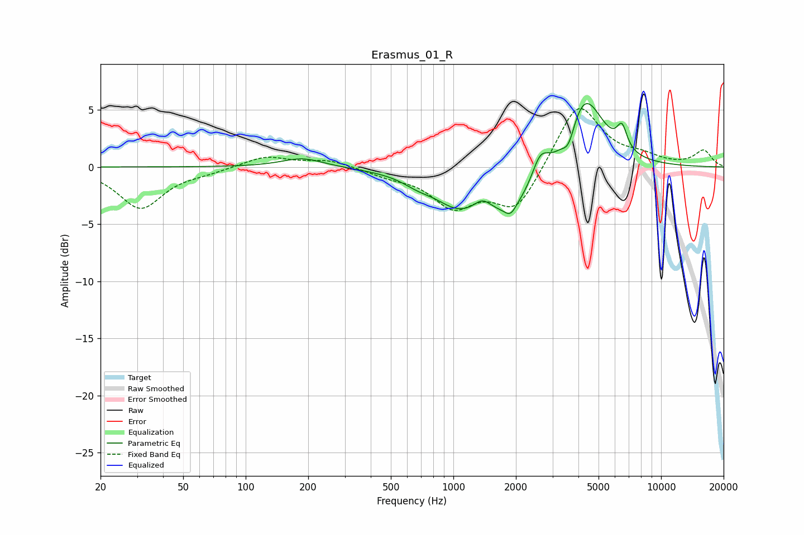

# Erasmus_01_R
See [usage instructions](https://github.com/jaakkopasanen/AutoEq#usage) for more options and info.

### Parametric EQs
Apply preamp of -5.6 dB when using parametric equalizer.

|   # | Type    |   Fc (Hz) |    Q |   Gain (dB) |
|-----|---------|-----------|------|-------------|
|   1 | Peaking |       188 | 1.4  |         0.8 |
|   2 | Peaking |       673 | 2.02 |        -0.6 |
|   3 | Peaking |      1028 | 1.37 |        -1.7 |
|   4 | Peaking |      1383 | 3.3  |         1.1 |
|   5 | Peaking |      1872 | 0.72 |        -4.1 |
|   6 | Peaking |      1883 | 5.07 |        -0.9 |
|   7 | Peaking |      2618 | 3.4  |         2.5 |
|   8 | Peaking |      3592 | 4.65 |        -1.7 |
|   9 | Peaking |      4256 | 1.47 |         7.2 |
|  10 | Peaking |      6484 | 5.68 |         2   |

### Fixed Band EQs
When using fixed band (also called graphic) equalizer, apply preamp of **-5.2 dB** (if available) and set gains manually with these parameters.

|   # | Type    |   Fc (Hz) |    Q |   Gain (dB) |
|-----|---------|-----------|------|-------------|
|   1 | Peaking |        31 | 1.41 |        -3.6 |
|   2 | Peaking |        62 | 1.41 |        -0.4 |
|   3 | Peaking |       125 | 1.41 |         1   |
|   4 | Peaking |       250 | 1.41 |         0.6 |
|   5 | Peaking |       500 | 1.41 |        -0.6 |
|   6 | Peaking |      1000 | 1.41 |        -3.2 |
|   7 | Peaking |      2000 | 1.41 |        -3.8 |
|   8 | Peaking |      4000 | 1.41 |         5.7 |
|   9 | Peaking |      8000 | 1.41 |         0.7 |
|  10 | Peaking |     16000 | 1.41 |         1.4 |

### Graphs

