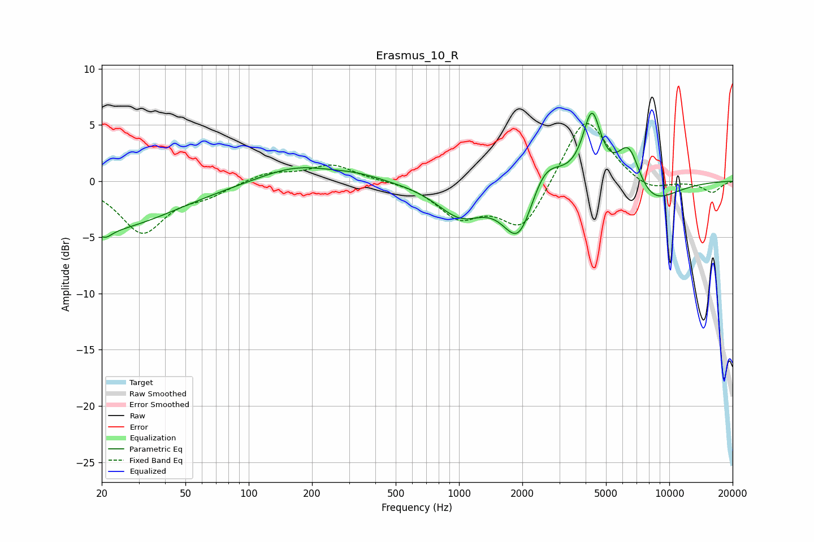

# Erasmus_10_R
See [usage instructions](https://github.com/jaakkopasanen/AutoEq#usage) for more options and info.

### Parametric EQs
Apply preamp of -6.1 dB when using parametric equalizer.

|   # | Type    |   Fc (Hz) |    Q |   Gain (dB) |
|-----|---------|-----------|------|-------------|
|   1 | Peaking |        20 | 0.43 |        -4.3 |
|   2 | Peaking |        21 | 4.35 |        -0.7 |
|   3 | Peaking |       168 | 0.81 |         1.4 |
|   4 | Peaking |       328 | 1.18 |         0.5 |
|   5 | Peaking |      1017 | 1.24 |        -2.9 |
|   6 | Peaking |      1930 | 1.87 |        -5.3 |
|   7 | Peaking |      2537 | 1.81 |         2.9 |
|   8 | Peaking |      4284 | 3.24 |         6   |
|   9 | Peaking |      6433 | 2.41 |         4.3 |
|  10 | Peaking |      7877 | 1.08 |        -2.6 |

### Fixed Band EQs
When using fixed band (also called graphic) equalizer, apply preamp of **-5.2 dB** (if available) and set gains manually with these parameters.

|   # | Type    |   Fc (Hz) |    Q |   Gain (dB) |
|-----|---------|-----------|------|-------------|
|   1 | Peaking |        31 | 1.41 |        -4.5 |
|   2 | Peaking |        62 | 1.41 |        -1   |
|   3 | Peaking |       125 | 1.41 |         0.8 |
|   4 | Peaking |       250 | 1.41 |         1.5 |
|   5 | Peaking |       500 | 1.41 |         0.1 |
|   6 | Peaking |      1000 | 1.41 |        -3   |
|   7 | Peaking |      2000 | 1.41 |        -4.3 |
|   8 | Peaking |      4000 | 1.41 |         6.1 |
|   9 | Peaking |      8000 | 1.41 |        -1   |
|  10 | Peaking |     16000 | 1.41 |        -1   |

### Graphs

