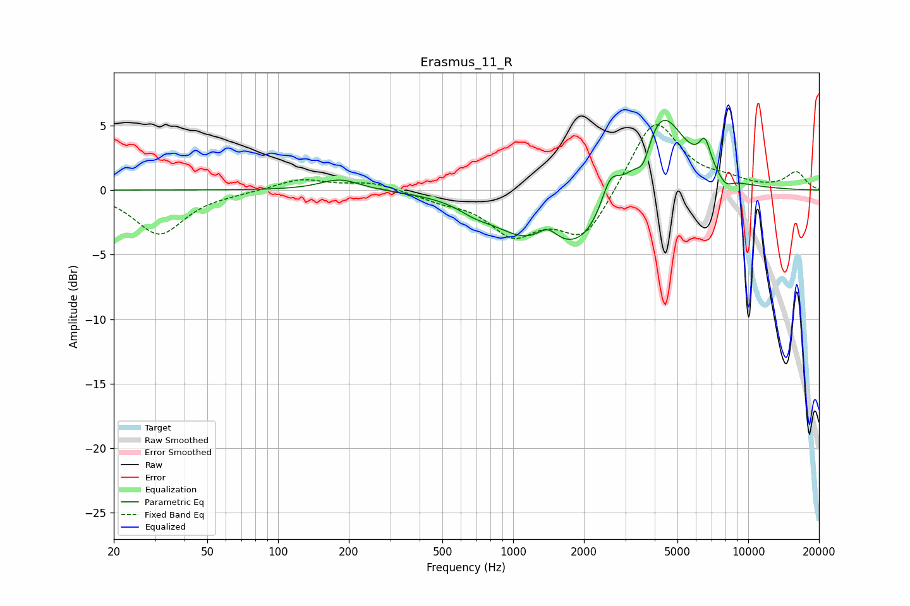

# Erasmus_11_R
See [usage instructions](https://github.com/jaakkopasanen/AutoEq#usage) for more options and info.

### Parametric EQs
Apply preamp of -5.5 dB when using parametric equalizer.

|   # | Type    |   Fc (Hz) |    Q |   Gain (dB) |
|-----|---------|-----------|------|-------------|
|   1 | Peaking |       184 | 1.67 |         0.9 |
|   2 | Peaking |       688 | 1.96 |        -0.6 |
|   3 | Peaking |      1061 | 1.11 |        -1.9 |
|   4 | Peaking |      1402 | 3.33 |         1.1 |
|   5 | Peaking |      1949 | 0.86 |        -4.6 |
|   6 | Peaking |      2587 | 3.52 |         2.5 |
|   7 | Peaking |      3585 | 4.57 |        -1.8 |
|   8 | Peaking |      4223 | 1.34 |         7   |
|   9 | Peaking |      6550 | 5.43 |         2.1 |
|  10 | Peaking |      8007 | 4.48 |        -0.7 |

### Fixed Band EQs
When using fixed band (also called graphic) equalizer, apply preamp of **-5.2 dB** (if available) and set gains manually with these parameters.

|   # | Type    |   Fc (Hz) |    Q |   Gain (dB) |
|-----|---------|-----------|------|-------------|
|   1 | Peaking |        31 | 1.41 |        -3.4 |
|   2 | Peaking |        62 | 1.41 |        -0.1 |
|   3 | Peaking |       125 | 1.41 |         0.9 |
|   4 | Peaking |       250 | 1.41 |         0.6 |
|   5 | Peaking |       500 | 1.41 |        -0.6 |
|   6 | Peaking |      1000 | 1.41 |        -3.2 |
|   7 | Peaking |      2000 | 1.41 |        -3.7 |
|   8 | Peaking |      4000 | 1.41 |         5.7 |
|   9 | Peaking |      8000 | 1.41 |         0.6 |
|  10 | Peaking |     16000 | 1.41 |         1.4 |

### Graphs

