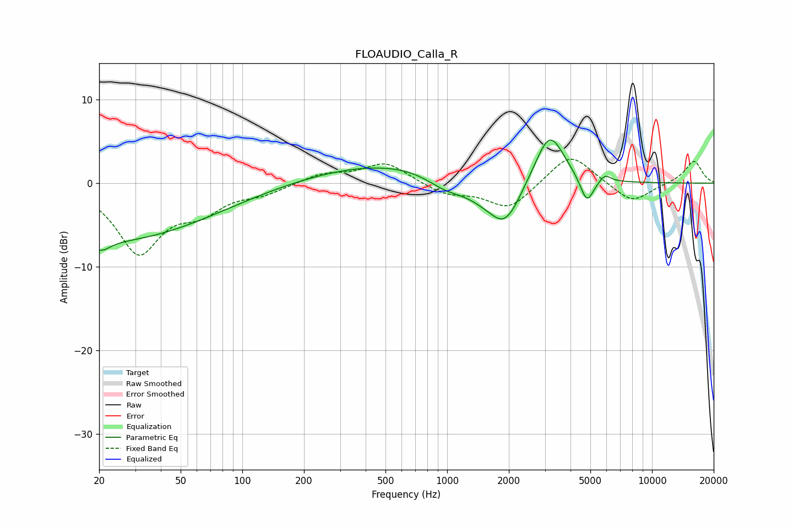

# FLOAUDIO_Calla_R
See [usage instructions](https://github.com/jaakkopasanen/AutoEq#usage) for more options and info.

### Parametric EQs
Apply preamp of -5.3 dB when using parametric equalizer.

|   # | Type    |   Fc (Hz) |    Q |   Gain (dB) |
|-----|---------|-----------|------|-------------|
|   1 | Peaking |        20 | 3.17 |        -1.3 |
|   2 | Peaking |        23 | 0.29 |        -6.8 |
|   3 | Peaking |       577 | 0.34 |         2.6 |
|   4 | Peaking |       977 | 1.48 |        -1.6 |
|   5 | Peaking |      1709 | 1.06 |        -3.8 |
|   6 | Peaking |      1865 | 2.42 |        -1.6 |
|   7 | Peaking |      2033 | 2.38 |        -1.4 |
|   8 | Peaking |      3161 | 1.93 |         6.5 |
|   9 | Peaking |      4807 | 4.23 |        -3.2 |
|  10 | Peaking |      5902 | 5.19 |         0.9 |

### Fixed Band EQs
When using fixed band (also called graphic) equalizer, apply preamp of **-3.0 dB** (if available) and set gains manually with these parameters.

|   # | Type    |   Fc (Hz) |    Q |   Gain (dB) |
|-----|---------|-----------|------|-------------|
|   1 | Peaking |        31 | 1.41 |        -8.1 |
|   2 | Peaking |        62 | 1.41 |        -2.7 |
|   3 | Peaking |       125 | 1.41 |        -1.1 |
|   4 | Peaking |       250 | 1.41 |         1.1 |
|   5 | Peaking |       500 | 1.41 |         2.5 |
|   6 | Peaking |      1000 | 1.41 |        -1.3 |
|   7 | Peaking |      2000 | 1.41 |        -3.1 |
|   8 | Peaking |      4000 | 1.41 |         3.7 |
|   9 | Peaking |      8000 | 1.41 |        -2.4 |
|  10 | Peaking |     16000 | 1.41 |         2.7 |

### Graphs

