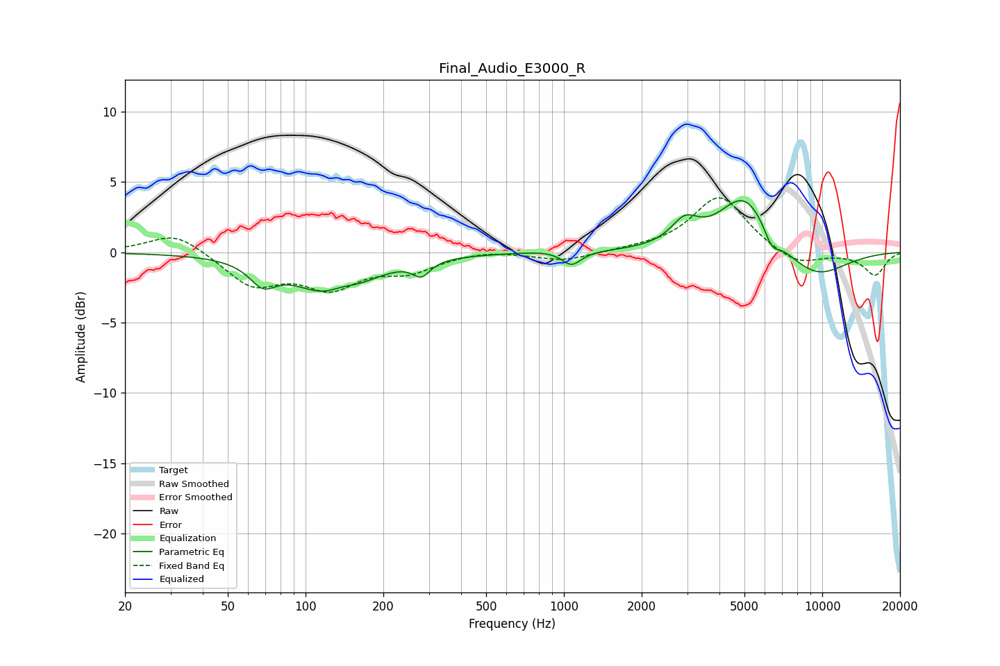

# Final_Audio_E3000_R
See [usage instructions](https://github.com/jaakkopasanen/AutoEq#usage) for more options and info.

### Parametric EQs
Apply preamp of -3.8 dB when using parametric equalizer.

|   # | Type    |   Fc (Hz) |    Q |   Gain (dB) |
|-----|---------|-----------|------|-------------|
|   1 | Peaking |        68 | 2.82 |        -1.5 |
|   2 | Peaking |       128 | 1.02 |        -3.2 |
|   3 | Peaking |       137 | 2.34 |         0.7 |
|   4 | Peaking |       281 | 4.35 |        -1   |
|   5 | Peaking |       869 | 1.72 |         0.1 |
|   6 | Peaking |      1070 | 3.77 |        -1   |
|   7 | Peaking |      2937 | 2.69 |         1.7 |
|   8 | Peaking |      5002 | 1.38 |         4.2 |
|   9 | Peaking |      6378 | 4.57 |        -1.2 |
|  10 | Peaking |      9315 | 0.98 |        -2   |

### Fixed Band EQs
When using fixed band (also called graphic) equalizer, apply preamp of **-4.0 dB** (if available) and set gains manually with these parameters.

|   # | Type    |   Fc (Hz) |    Q |   Gain (dB) |
|-----|---------|-----------|------|-------------|
|   1 | Peaking |        31 | 1.41 |         1.5 |
|   2 | Peaking |        62 | 1.41 |        -2.3 |
|   3 | Peaking |       125 | 1.41 |        -2.3 |
|   4 | Peaking |       250 | 1.41 |        -1.2 |
|   5 | Peaking |       500 | 1.41 |         0.2 |
|   6 | Peaking |      1000 | 1.41 |        -0.6 |
|   7 | Peaking |      2000 | 1.41 |         0.2 |
|   8 | Peaking |      4000 | 1.41 |         4   |
|   9 | Peaking |      8000 | 1.41 |        -1   |
|  10 | Peaking |     16000 | 1.41 |        -1.6 |

### Graphs

