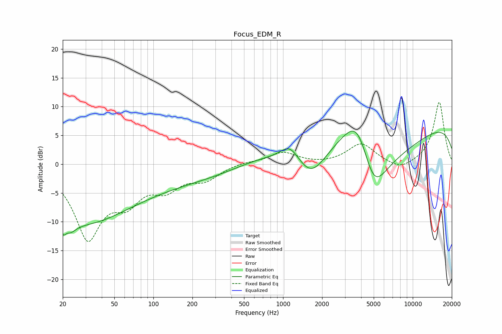

# Focus_EDM_R
See [usage instructions](https://github.com/jaakkopasanen/AutoEq#usage) for more options and info.

### Parametric EQs
Apply preamp of -5.8 dB when using parametric equalizer.

|   # | Type    |   Fc (Hz) |    Q |   Gain (dB) |
|-----|---------|-----------|------|-------------|
|   1 | Peaking |        21 | 3.21 |        -6.1 |
|   2 | Peaking |        21 | 5.44 |         2.8 |
|   3 | Peaking |        29 | 0.42 |        -8.4 |
|   4 | Peaking |       148 | 0.22 |        -3   |
|   5 | Peaking |       670 | 0.57 |         2.1 |
|   6 | Peaking |      1127 | 1.98 |         2.8 |
|   7 | Peaking |      1652 | 1.33 |        -4.3 |
|   8 | Peaking |      3785 | 0.85 |        14.8 |
|   9 | Peaking |      4949 | 0.71 |       -20   |
|  10 | Peaking |     10000 | 0.18 |         8.2 |

### Fixed Band EQs
When using fixed band (also called graphic) equalizer, apply preamp of **-10.8 dB** (if available) and set gains manually with these parameters.

|   # | Type    |   Fc (Hz) |    Q |   Gain (dB) |
|-----|---------|-----------|------|-------------|
|   1 | Peaking |        31 | 1.41 |       -12.4 |
|   2 | Peaking |        62 | 1.41 |        -5   |
|   3 | Peaking |       125 | 1.41 |        -3.5 |
|   4 | Peaking |       250 | 1.41 |        -2.4 |
|   5 | Peaking |       500 | 1.41 |         0.4 |
|   6 | Peaking |      1000 | 1.41 |         2   |
|   7 | Peaking |      2000 | 1.41 |        -0.1 |
|   8 | Peaking |      4000 | 1.41 |         3.5 |
|   9 | Peaking |      8000 | 1.41 |        -1.3 |
|  10 | Peaking |     16000 | 1.41 |        10.8 |

### Graphs

