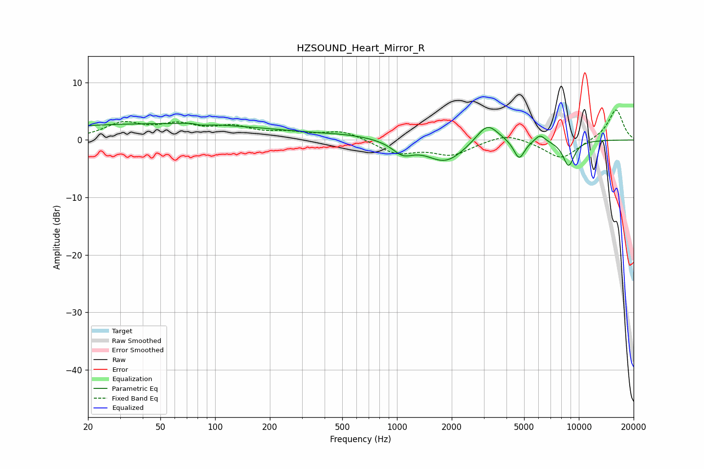

# HZSOUND_Heart_Mirror_R
See [usage instructions](https://github.com/jaakkopasanen/AutoEq#usage) for more options and info.

### Parametric EQs
Apply preamp of -3.0 dB when using parametric equalizer.

|   # | Type    |   Fc (Hz) |    Q |   Gain (dB) |
|-----|---------|-----------|------|-------------|
|   1 | Peaking |        47 | 0.18 |         2.8 |
|   2 | Peaking |        81 | 2.79 |         2.8 |
|   3 | Peaking |        82 | 3    |        -2.9 |
|   4 | Peaking |       547 | 0.75 |         0.6 |
|   5 | Peaking |      1076 | 2.49 |        -2.1 |
|   6 | Peaking |      1847 | 1.35 |        -3.9 |
|   7 | Peaking |      3139 | 2.32 |         3.5 |
|   8 | Peaking |      4697 | 4.67 |        -3.4 |
|   9 | Peaking |      6119 | 4.84 |         1.3 |
|  10 | Peaking |      8785 | 3.96 |        -4.4 |

### Fixed Band EQs
When using fixed band (also called graphic) equalizer, apply preamp of **-5.3 dB** (if available) and set gains manually with these parameters.

|   # | Type    |   Fc (Hz) |    Q |   Gain (dB) |
|-----|---------|-----------|------|-------------|
|   1 | Peaking |        31 | 1.41 |         2.7 |
|   2 | Peaking |        62 | 1.41 |         2.2 |
|   3 | Peaking |       125 | 1.41 |         1.9 |
|   4 | Peaking |       250 | 1.41 |         1   |
|   5 | Peaking |       500 | 1.41 |         1.6 |
|   6 | Peaking |      1000 | 1.41 |        -2.3 |
|   7 | Peaking |      2000 | 1.41 |        -2.5 |
|   8 | Peaking |      4000 | 1.41 |         1.3 |
|   9 | Peaking |      8000 | 1.41 |        -3.4 |
|  10 | Peaking |     16000 | 1.41 |         5.4 |

### Graphs

