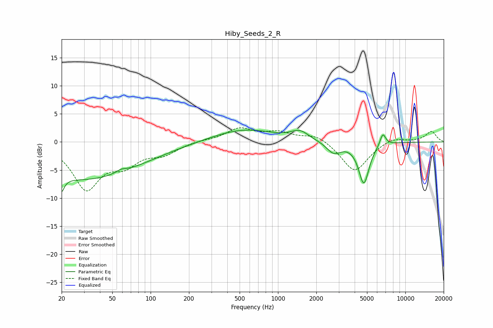

# Hiby_Seeds_2_R
See [usage instructions](https://github.com/jaakkopasanen/AutoEq#usage) for more options and info.

### Parametric EQs
Apply preamp of -2.2 dB when using parametric equalizer.

|   # | Type    |   Fc (Hz) |    Q |   Gain (dB) |
|-----|---------|-----------|------|-------------|
|   1 | Peaking |        20 | 5.8  |        -6.1 |
|   2 | Peaking |        20 | 5.7  |         3.4 |
|   3 | Peaking |        25 | 0.31 |        -5.4 |
|   4 | Peaking |        53 | 0.35 |        -1.5 |
|   5 | Peaking |        59 | 3.64 |         0.6 |
|   6 | Peaking |       536 | 0.58 |         2.3 |
|   7 | Peaking |      1486 | 2.11 |         1.5 |
|   8 | Peaking |      2741 | 2.51 |        -2   |
|   9 | Peaking |      4722 | 3.38 |        -7.3 |
|  10 | Peaking |      6655 | 5.96 |         2.2 |

### Fixed Band EQs
When using fixed band (also called graphic) equalizer, apply preamp of **-2.6 dB** (if available) and set gains manually with these parameters.

|   # | Type    |   Fc (Hz) |    Q |   Gain (dB) |
|-----|---------|-----------|------|-------------|
|   1 | Peaking |        31 | 1.41 |        -8.1 |
|   2 | Peaking |        62 | 1.41 |        -3.3 |
|   3 | Peaking |       125 | 1.41 |        -1.9 |
|   4 | Peaking |       250 | 1.41 |         0.3 |
|   5 | Peaking |       500 | 1.41 |         2.3 |
|   6 | Peaking |      1000 | 1.41 |         1.5 |
|   7 | Peaking |      2000 | 1.41 |         1.4 |
|   8 | Peaking |      4000 | 1.41 |        -5.4 |
|   9 | Peaking |      8000 | 1.41 |         0.9 |
|  10 | Peaking |     16000 | 1.41 |         1.9 |

### Graphs

