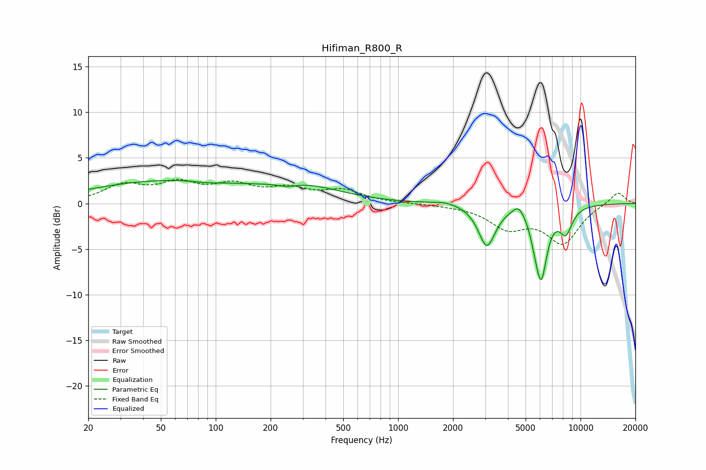

# Hifiman_R800_R
See [usage instructions](https://github.com/jaakkopasanen/AutoEq#usage) for more options and info.

### Parametric EQs
Apply preamp of -2.6 dB when using parametric equalizer.

|   # | Type    |   Fc (Hz) |    Q |   Gain (dB) |
|-----|---------|-----------|------|-------------|
|   1 | Peaking |        55 | 0.32 |         2.5 |
|   2 | Peaking |        90 | 1.88 |        -0.2 |
|   3 | Peaking |       247 | 2.78 |        -0.4 |
|   4 | Peaking |       310 | 0.69 |         1.5 |
|   5 | Peaking |      1846 | 1.97 |         0.3 |
|   6 | Peaking |      3066 | 3.06 |        -4.5 |
|   7 | Peaking |      4578 | 4.26 |         1.2 |
|   8 | Peaking |      5563 | 6    |        -0.8 |
|   9 | Peaking |      6074 | 4.11 |        -7.7 |
|  10 | Peaking |      8312 | 3.66 |        -2.7 |

### Fixed Band EQs
When using fixed band (also called graphic) equalizer, apply preamp of **-2.7 dB** (if available) and set gains manually with these parameters.

|   # | Type    |   Fc (Hz) |    Q |   Gain (dB) |
|-----|---------|-----------|------|-------------|
|   1 | Peaking |        31 | 1.41 |         1.9 |
|   2 | Peaking |        62 | 1.41 |         1.9 |
|   3 | Peaking |       125 | 1.41 |         1.8 |
|   4 | Peaking |       250 | 1.41 |         1.4 |
|   5 | Peaking |       500 | 1.41 |         1.3 |
|   6 | Peaking |      1000 | 1.41 |         0   |
|   7 | Peaking |      2000 | 1.41 |        -0.1 |
|   8 | Peaking |      4000 | 1.41 |        -2.4 |
|   9 | Peaking |      8000 | 1.41 |        -4.2 |
|  10 | Peaking |     16000 | 1.41 |         1.3 |

### Graphs

