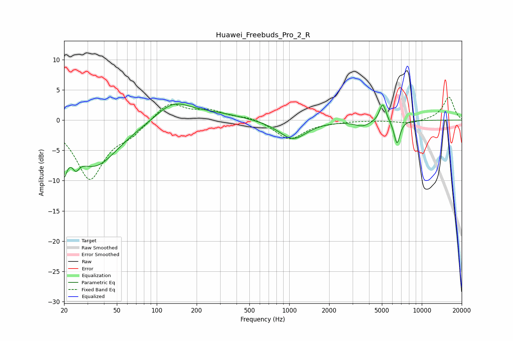

# Huawei_Freebuds_Pro_2_R
See [usage instructions](https://github.com/jaakkopasanen/AutoEq#usage) for more options and info.

### Parametric EQs
Apply preamp of -2.8 dB when using parametric equalizer.

|   # | Type    |   Fc (Hz) |    Q |   Gain (dB) |
|-----|---------|-----------|------|-------------|
|   1 | Peaking |        20 | 5.65 |        -8.3 |
|   2 | Peaking |        20 | 5.84 |         3.3 |
|   3 | Peaking |        25 | 5.66 |        -1.9 |
|   4 | Peaking |        34 | 0.79 |        -7.6 |
|   5 | Peaking |       133 | 1.09 |         3.1 |
|   6 | Peaking |       274 | 0.7  |         1   |
|   7 | Peaking |      1062 | 1.36 |        -3.2 |
|   8 | Peaking |      3569 | 2.43 |        -0.9 |
|   9 | Peaking |      5072 | 5.63 |         3.1 |
|  10 | Peaking |      6501 | 6    |        -3.9 |

### Fixed Band EQs
When using fixed band (also called graphic) equalizer, apply preamp of **-3.9 dB** (if available) and set gains manually with these parameters.

|   # | Type    |   Fc (Hz) |    Q |   Gain (dB) |
|-----|---------|-----------|------|-------------|
|   1 | Peaking |        31 | 1.41 |        -9.6 |
|   2 | Peaking |        62 | 1.41 |        -1.8 |
|   3 | Peaking |       125 | 1.41 |         3.1 |
|   4 | Peaking |       250 | 1.41 |         1.4 |
|   5 | Peaking |       500 | 1.41 |         0.5 |
|   6 | Peaking |      1000 | 1.41 |        -3.2 |
|   7 | Peaking |      2000 | 1.41 |        -0.2 |
|   8 | Peaking |      4000 | 1.41 |        -0   |
|   9 | Peaking |      8000 | 1.41 |        -0.6 |
|  10 | Peaking |     16000 | 1.41 |         3.8 |

### Graphs

