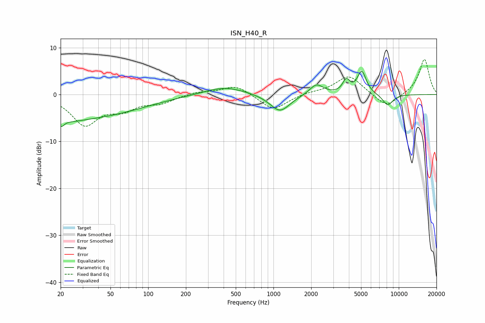

# ISN_H40_R
See [usage instructions](https://github.com/jaakkopasanen/AutoEq#usage) for more options and info.

### Parametric EQs
Apply preamp of -5.0 dB when using parametric equalizer.

|   # | Type    |   Fc (Hz) |    Q |   Gain (dB) |
|-----|---------|-----------|------|-------------|
|   1 | Peaking |        20 | 5.82 |        -4.9 |
|   2 | Peaking |        20 | 5.93 |         3.2 |
|   3 | Peaking |        23 | 1.15 |        -1.3 |
|   4 | Peaking |        35 | 0.35 |        -4.5 |
|   5 | Peaking |       405 | 0.88 |         1.8 |
|   6 | Peaking |      1126 | 1.77 |        -3.8 |
|   7 | Peaking |      2203 | 2.56 |         2.3 |
|   8 | Peaking |      3807 | 4.97 |         2.6 |
|   9 | Peaking |      5064 | 3.87 |         4.8 |
|  10 | Peaking |      8163 | 3.15 |        -2.4 |

### Fixed Band EQs
When using fixed band (also called graphic) equalizer, apply preamp of **-7.6 dB** (if available) and set gains manually with these parameters.

|   # | Type    |   Fc (Hz) |    Q |   Gain (dB) |
|-----|---------|-----------|------|-------------|
|   1 | Peaking |        31 | 1.41 |        -6.2 |
|   2 | Peaking |        62 | 1.41 |        -2.7 |
|   3 | Peaking |       125 | 1.41 |        -1.6 |
|   4 | Peaking |       250 | 1.41 |         0.6 |
|   5 | Peaking |       500 | 1.41 |         2   |
|   6 | Peaking |      1000 | 1.41 |        -3.4 |
|   7 | Peaking |      2000 | 1.41 |         0.4 |
|   8 | Peaking |      4000 | 1.41 |         4.1 |
|   9 | Peaking |      8000 | 1.41 |        -2.9 |
|  10 | Peaking |     16000 | 1.41 |         7.6 |

### Graphs

