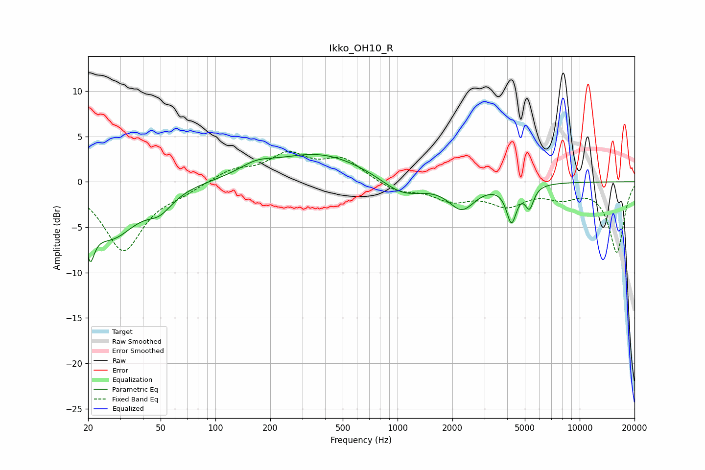

# Ikko_OH10_R
See [usage instructions](https://github.com/jaakkopasanen/AutoEq#usage) for more options and info.

### Parametric EQs
Apply preamp of -3.1 dB when using parametric equalizer.

|   # | Type    |   Fc (Hz) |    Q |   Gain (dB) |
|-----|---------|-----------|------|-------------|
|   1 | Peaking |        21 | 5.78 |        -7.5 |
|   2 | Peaking |        21 | 5.93 |         3.2 |
|   3 | Peaking |        27 | 0.99 |        -5.8 |
|   4 | Peaking |        49 | 2.04 |        -1.8 |
|   5 | Peaking |       167 | 1.55 |         1   |
|   6 | Peaking |       371 | 0.56 |         3.1 |
|   7 | Peaking |      1064 | 1.22 |        -1.9 |
|   8 | Peaking |      2254 | 1.97 |        -2.9 |
|   9 | Peaking |      4222 | 5.12 |        -3.9 |
|  10 | Peaking |      5300 | 5.95 |        -2.3 |

### Fixed Band EQs
When using fixed band (also called graphic) equalizer, apply preamp of **-3.4 dB** (if available) and set gains manually with these parameters.

|   # | Type    |   Fc (Hz) |    Q |   Gain (dB) |
|-----|---------|-----------|------|-------------|
|   1 | Peaking |        31 | 1.41 |        -7.5 |
|   2 | Peaking |        62 | 1.41 |        -0.9 |
|   3 | Peaking |       125 | 1.41 |         1.3 |
|   4 | Peaking |       250 | 1.41 |         2.8 |
|   5 | Peaking |       500 | 1.41 |         2.4 |
|   6 | Peaking |      1000 | 1.41 |        -1.1 |
|   7 | Peaking |      2000 | 1.41 |        -1.8 |
|   8 | Peaking |      4000 | 1.41 |        -2.3 |
|   9 | Peaking |      8000 | 1.41 |        -1.4 |
|  10 | Peaking |     16000 | 1.41 |        -7.7 |

### Graphs

