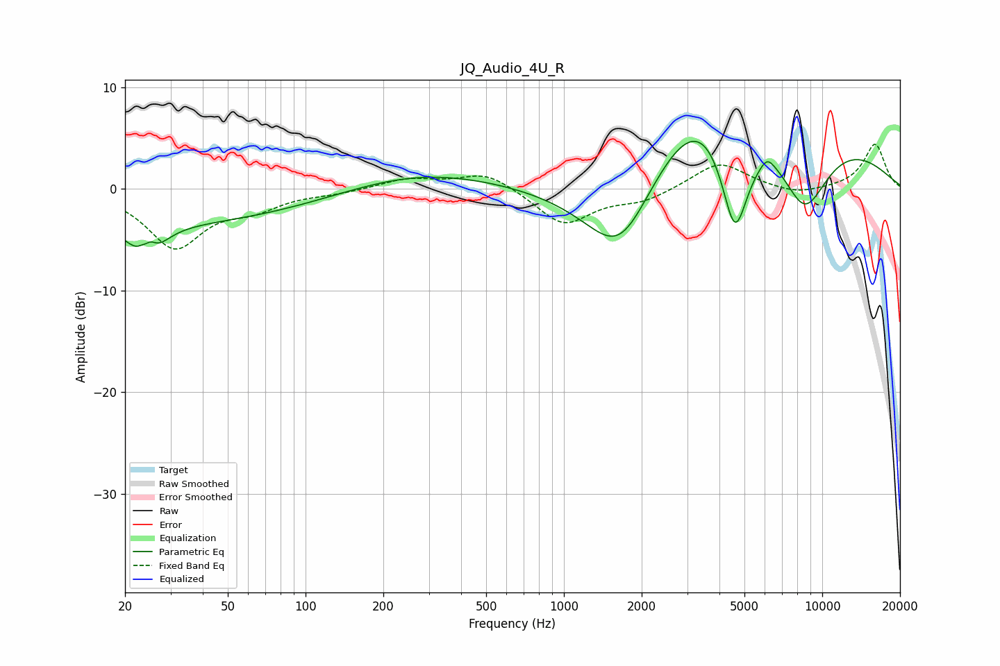

# JQ_Audio_4U_R
See [usage instructions](https://github.com/jaakkopasanen/AutoEq#usage) for more options and info.

### Parametric EQs
Apply preamp of -4.8 dB when using parametric equalizer.

|   # | Type    |   Fc (Hz) |    Q |   Gain (dB) |
|-----|---------|-----------|------|-------------|
|   1 | Peaking |        22 | 0.19 |        -3.5 |
|   2 | Peaking |        23 | 5.65 |         2   |
|   3 | Peaking |        24 | 3.2  |        -6.5 |
|   4 | Peaking |        25 | 5.26 |         3.2 |
|   5 | Peaking |       269 | 0.5  |         1.7 |
|   6 | Peaking |      1654 | 0.67 |       -15.8 |
|   7 | Peaking |      3827 | 0.35 |        19.6 |
|   8 | Peaking |      4590 | 1.92 |       -15   |
|   9 | Peaking |      6128 | 5.08 |         1   |
|  10 | Peaking |      8511 | 1.19 |        -9.9 |

### Fixed Band EQs
When using fixed band (also called graphic) equalizer, apply preamp of **-4.5 dB** (if available) and set gains manually with these parameters.

|   # | Type    |   Fc (Hz) |    Q |   Gain (dB) |
|-----|---------|-----------|------|-------------|
|   1 | Peaking |        31 | 1.41 |        -5.6 |
|   2 | Peaking |        62 | 1.41 |        -1.6 |
|   3 | Peaking |       125 | 1.41 |        -0.3 |
|   4 | Peaking |       250 | 1.41 |         1   |
|   5 | Peaking |       500 | 1.41 |         1.7 |
|   6 | Peaking |      1000 | 1.41 |        -3.5 |
|   7 | Peaking |      2000 | 1.41 |        -1.1 |
|   8 | Peaking |      4000 | 1.41 |         2.7 |
|   9 | Peaking |      8000 | 1.41 |        -0.7 |
|  10 | Peaking |     16000 | 1.41 |         4.4 |

### Graphs

