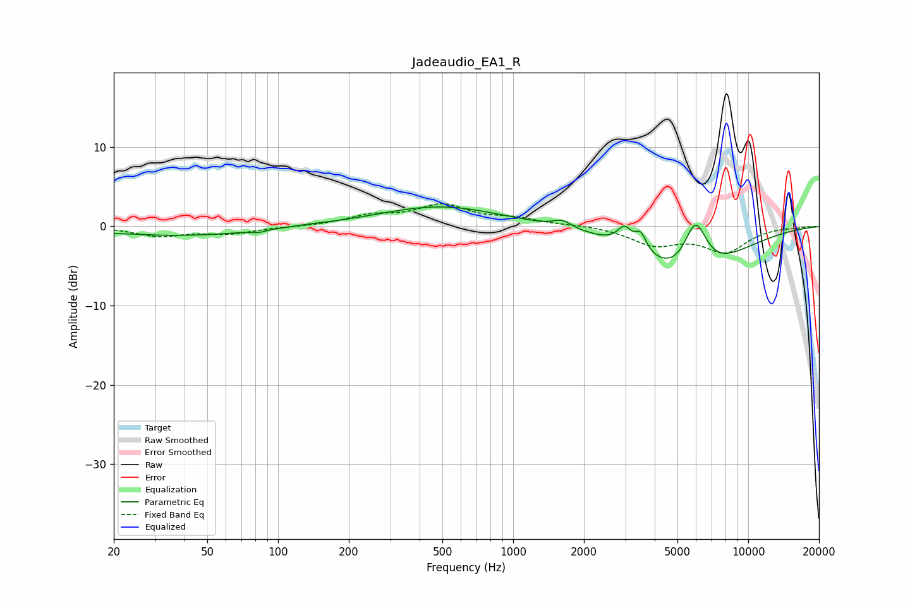

# Jadeaudio_EA1_R
See [usage instructions](https://github.com/jaakkopasanen/AutoEq#usage) for more options and info.

### Parametric EQs
Apply preamp of -2.5 dB when using parametric equalizer.

|   # | Type    |   Fc (Hz) |    Q |   Gain (dB) |
|-----|---------|-----------|------|-------------|
|   1 | Peaking |        20 | 5.32 |        -0.1 |
|   2 | Peaking |        39 | 0.44 |        -1.2 |
|   3 | Peaking |        82 | 5.2  |        -0.3 |
|   4 | Peaking |       135 | 2.02 |         0.1 |
|   5 | Peaking |       490 | 0.55 |         2.6 |
|   6 | Peaking |      1621 | 3.58 |         0.9 |
|   7 | Peaking |      2978 | 4.65 |         2.3 |
|   8 | Peaking |      3492 | 5.96 |         2.2 |
|   9 | Peaking |      5626 | 0.77 |        -7.7 |
|  10 | Peaking |      5960 | 2.57 |         7.6 |

### Fixed Band EQs
When using fixed band (also called graphic) equalizer, apply preamp of **-2.9 dB** (if available) and set gains manually with these parameters.

|   # | Type    |   Fc (Hz) |    Q |   Gain (dB) |
|-----|---------|-----------|------|-------------|
|   1 | Peaking |        31 | 1.41 |        -1.2 |
|   2 | Peaking |        62 | 1.41 |        -0.8 |
|   3 | Peaking |       125 | 1.41 |        -0   |
|   4 | Peaking |       250 | 1.41 |         1.2 |
|   5 | Peaking |       500 | 1.41 |         2.5 |
|   6 | Peaking |      1000 | 1.41 |         0.8 |
|   7 | Peaking |      2000 | 1.41 |         0.2 |
|   8 | Peaking |      4000 | 1.41 |        -2.2 |
|   9 | Peaking |      8000 | 1.41 |        -3.1 |
|  10 | Peaking |     16000 | 1.41 |        -0.1 |

### Graphs

