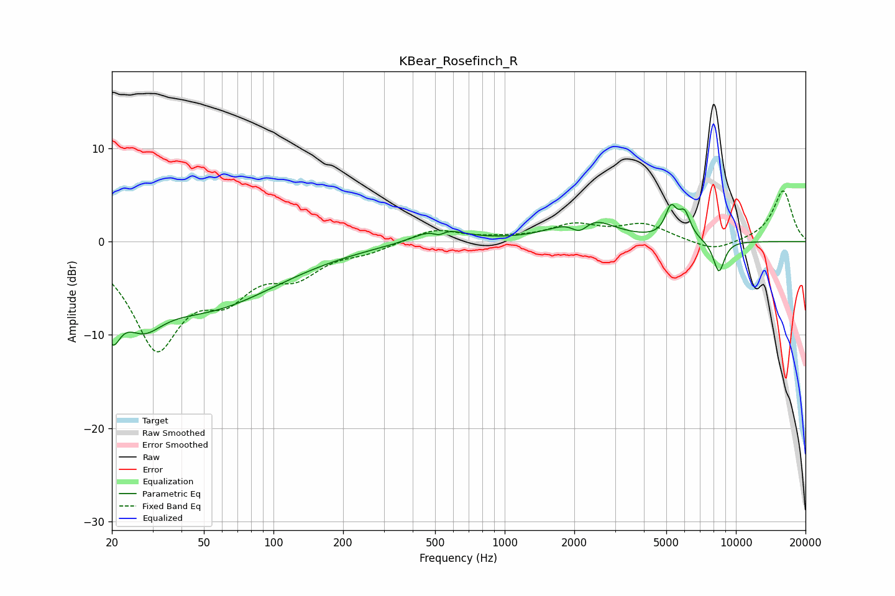

# KBear_Rosefinch_R
See [usage instructions](https://github.com/jaakkopasanen/AutoEq#usage) for more options and info.

### Parametric EQs
Apply preamp of -4.1 dB when using parametric equalizer.

|   # | Type    |   Fc (Hz) |    Q |   Gain (dB) |
|-----|---------|-----------|------|-------------|
|   1 | Peaking |        20 | 3.92 |        -5.4 |
|   2 | Peaking |        27 | 1.66 |        -4   |
|   3 | Peaking |        51 | 0.44 |        -6.9 |
|   4 | Peaking |       519 | 1.47 |         1.7 |
|   5 | Peaking |       519 | 5.52 |        -0.6 |
|   6 | Peaking |      2115 | 3.45 |        -2   |
|   7 | Peaking |      2204 | 1.36 |         3.2 |
|   8 | Peaking |      5240 | 5.61 |         3   |
|   9 | Peaking |      5998 | 5.3  |         2.6 |
|  10 | Peaking |      8444 | 5.24 |        -3.4 |

### Fixed Band EQs
When using fixed band (also called graphic) equalizer, apply preamp of **-5.5 dB** (if available) and set gains manually with these parameters.

|   # | Type    |   Fc (Hz) |    Q |   Gain (dB) |
|-----|---------|-----------|------|-------------|
|   1 | Peaking |        31 | 1.41 |       -10.9 |
|   2 | Peaking |        62 | 1.41 |        -4.4 |
|   3 | Peaking |       125 | 1.41 |        -3   |
|   4 | Peaking |       250 | 1.41 |        -0.9 |
|   5 | Peaking |       500 | 1.41 |         1.4 |
|   6 | Peaking |      1000 | 1.41 |         0.2 |
|   7 | Peaking |      2000 | 1.41 |         1.6 |
|   8 | Peaking |      4000 | 1.41 |         1.7 |
|   9 | Peaking |      8000 | 1.41 |        -1.1 |
|  10 | Peaking |     16000 | 1.41 |         5.5 |

### Graphs

