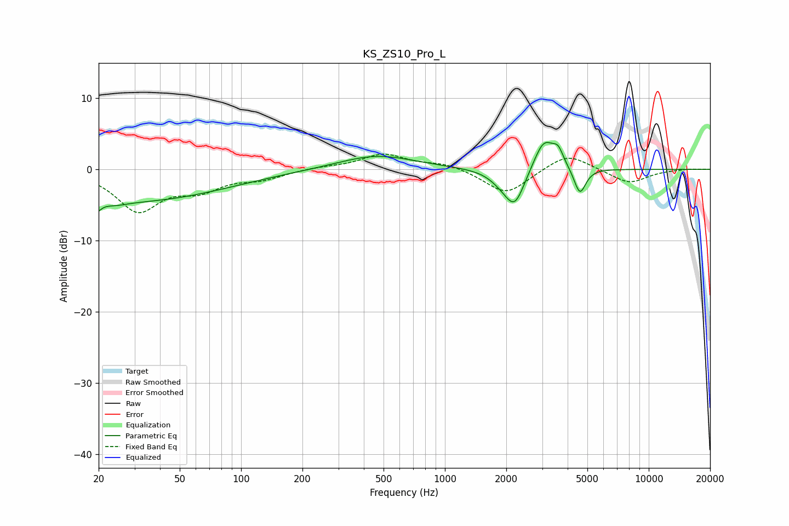

# KS_ZS10_Pro_L
See [usage instructions](https://github.com/jaakkopasanen/AutoEq#usage) for more options and info.

### Parametric EQs
Apply preamp of -3.9 dB when using parametric equalizer.

|   # | Type    |   Fc (Hz) |    Q |   Gain (dB) |
|-----|---------|-----------|------|-------------|
|   1 | Peaking |        20 | 5.75 |        -4.2 |
|   2 | Peaking |        20 | 6    |         2.8 |
|   3 | Peaking |        24 | 2.55 |        -0.5 |
|   4 | Peaking |        29 | 0.3  |        -4.5 |
|   5 | Peaking |       462 | 0.76 |         2   |
|   6 | Peaking |      1918 | 2.28 |        -1.2 |
|   7 | Peaking |      2205 | 2.9  |        -4.7 |
|   8 | Peaking |      3065 | 2.78 |         4.5 |
|   9 | Peaking |      3595 | 5.44 |         2   |
|  10 | Peaking |      4595 | 4.92 |        -3.7 |

### Fixed Band EQs
When using fixed band (also called graphic) equalizer, apply preamp of **-2.2 dB** (if available) and set gains manually with these parameters.

|   # | Type    |   Fc (Hz) |    Q |   Gain (dB) |
|-----|---------|-----------|------|-------------|
|   1 | Peaking |        31 | 1.41 |        -5.6 |
|   2 | Peaking |        62 | 1.41 |        -2.4 |
|   3 | Peaking |       125 | 1.41 |        -1.2 |
|   4 | Peaking |       250 | 1.41 |         0.3 |
|   5 | Peaking |       500 | 1.41 |         2.1 |
|   6 | Peaking |      1000 | 1.41 |         0.8 |
|   7 | Peaking |      2000 | 1.41 |        -3.6 |
|   8 | Peaking |      4000 | 1.41 |         2.4 |
|   9 | Peaking |      8000 | 1.41 |        -2   |
|  10 | Peaking |     16000 | 1.41 |         0.1 |

### Graphs

