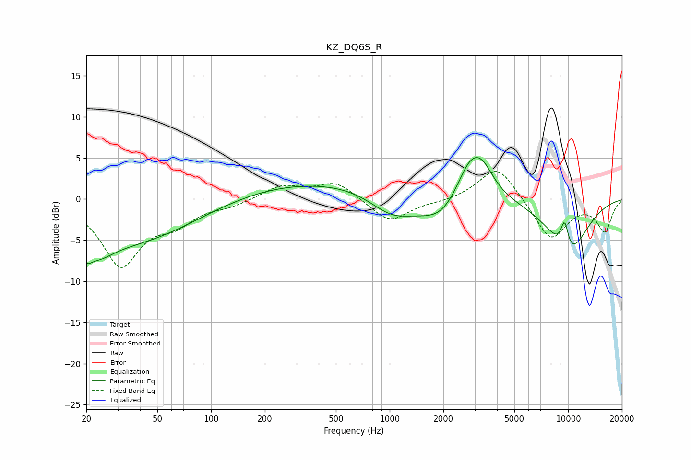

# KZ_DQ6S_R
See [usage instructions](https://github.com/jaakkopasanen/AutoEq#usage) for more options and info.

### Parametric EQs
Apply preamp of -5.1 dB when using parametric equalizer.

|   # | Type    |   Fc (Hz) |    Q |   Gain (dB) |
|-----|---------|-----------|------|-------------|
|   1 | Peaking |        20 | 5.25 |        -1.5 |
|   2 | Peaking |        23 | 1.6  |        -2.5 |
|   3 | Peaking |        35 | 0.39 |        -5.2 |
|   4 | Peaking |       531 | 0.22 |         2.5 |
|   5 | Peaking |      1029 | 1.07 |        -3   |
|   6 | Peaking |      2013 | 0.98 |        -4.5 |
|   7 | Peaking |      2827 | 1.54 |         6.1 |
|   8 | Peaking |      3327 | 2.34 |         2   |
|   9 | Peaking |      9547 | 5.45 |         3.5 |
|  10 | Peaking |     10000 | 1.07 |        -6.7 |

### Fixed Band EQs
When using fixed band (also called graphic) equalizer, apply preamp of **-3.5 dB** (if available) and set gains manually with these parameters.

|   # | Type    |   Fc (Hz) |    Q |   Gain (dB) |
|-----|---------|-----------|------|-------------|
|   1 | Peaking |        31 | 1.41 |        -7.9 |
|   2 | Peaking |        62 | 1.41 |        -2.4 |
|   3 | Peaking |       125 | 1.41 |        -0.7 |
|   4 | Peaking |       250 | 1.41 |         1.6 |
|   5 | Peaking |       500 | 1.41 |         2.1 |
|   6 | Peaking |      1000 | 1.41 |        -2.9 |
|   7 | Peaking |      2000 | 1.41 |        -0.3 |
|   8 | Peaking |      4000 | 1.41 |         4.2 |
|   9 | Peaking |      8000 | 1.41 |        -5   |
|  10 | Peaking |     16000 | 1.41 |        -3.8 |

### Graphs

