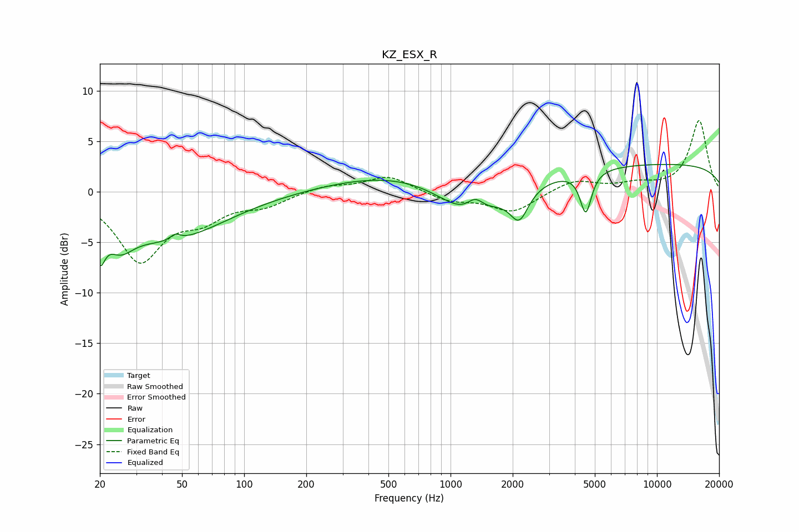

# KZ_ESX_R
See [usage instructions](https://github.com/jaakkopasanen/AutoEq#usage) for more options and info.

### Parametric EQs
Apply preamp of -2.8 dB when using parametric equalizer.

|   # | Type    |   Fc (Hz) |    Q |   Gain (dB) |
|-----|---------|-----------|------|-------------|
|   1 | Peaking |        20 | 5.9  |        -3.4 |
|   2 | Peaking |        25 | 2.18 |        -2.4 |
|   3 | Peaking |        43 | 0.52 |        -4.6 |
|   4 | Peaking |        46 | 5.94 |         0.6 |
|   5 | Peaking |       597 | 0.41 |         1.9 |
|   6 | Peaking |      1263 | 0.94 |        -3.9 |
|   7 | Peaking |      1316 | 3.5  |         1.4 |
|   8 | Peaking |      2154 | 3.17 |        -3   |
|   9 | Peaking |      4520 | 5.14 |        -4.1 |
|  10 | Peaking |     10000 | 0.18 |         2.8 |

### Fixed Band EQs
When using fixed band (also called graphic) equalizer, apply preamp of **-7.2 dB** (if available) and set gains manually with these parameters.

|   # | Type    |   Fc (Hz) |    Q |   Gain (dB) |
|-----|---------|-----------|------|-------------|
|   1 | Peaking |        31 | 1.41 |        -6.6 |
|   2 | Peaking |        62 | 1.41 |        -2.2 |
|   3 | Peaking |       125 | 1.41 |        -1.2 |
|   4 | Peaking |       250 | 1.41 |         0.6 |
|   5 | Peaking |       500 | 1.41 |         1.6 |
|   6 | Peaking |      1000 | 1.41 |        -0.9 |
|   7 | Peaking |      2000 | 1.41 |        -2   |
|   8 | Peaking |      4000 | 1.41 |         1.2 |
|   9 | Peaking |      8000 | 1.41 |         0.7 |
|  10 | Peaking |     16000 | 1.41 |         7.1 |

### Graphs

