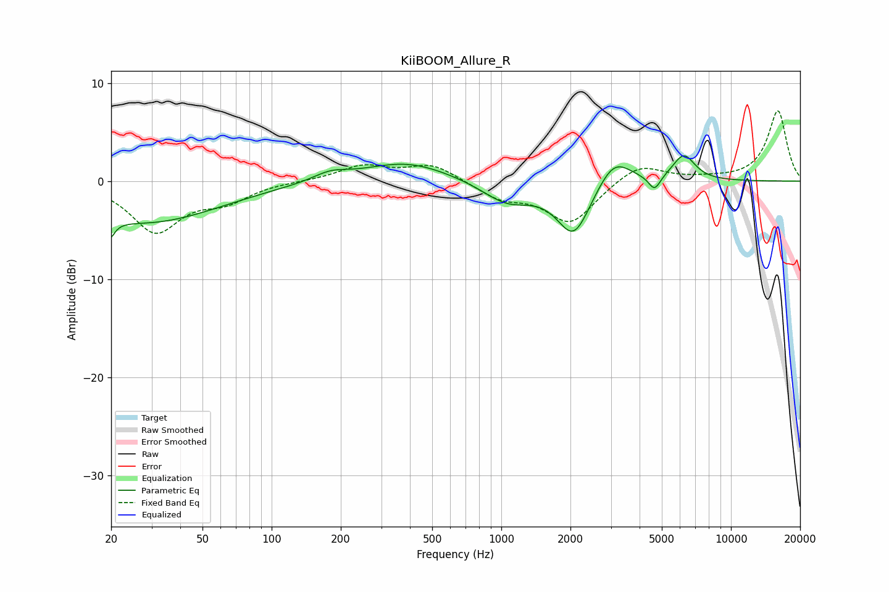

# KiiBOOM_Allure_R
See [usage instructions](https://github.com/jaakkopasanen/AutoEq#usage) for more options and info.

### Parametric EQs
Apply preamp of -2.7 dB when using parametric equalizer.

|   # | Type    |   Fc (Hz) |    Q |   Gain (dB) |
|-----|---------|-----------|------|-------------|
|   1 | Peaking |        20 | 5.77 |        -4.4 |
|   2 | Peaking |        20 | 5.99 |         2.5 |
|   3 | Peaking |        28 | 0.44 |        -4.2 |
|   4 | Peaking |       180 | 1.88 |         0.8 |
|   5 | Peaking |       386 | 0.76 |         2   |
|   6 | Peaking |      1062 | 1.28 |        -2.2 |
|   7 | Peaking |      2068 | 1.93 |        -5.5 |
|   8 | Peaking |      3096 | 1.94 |         2.9 |
|   9 | Peaking |      4649 | 5.35 |        -1.6 |
|  10 | Peaking |      6234 | 2.8  |         2.6 |

### Fixed Band EQs
When using fixed band (also called graphic) equalizer, apply preamp of **-7.3 dB** (if available) and set gains manually with these parameters.

|   # | Type    |   Fc (Hz) |    Q |   Gain (dB) |
|-----|---------|-----------|------|-------------|
|   1 | Peaking |        31 | 1.41 |        -5   |
|   2 | Peaking |        62 | 1.41 |        -1.8 |
|   3 | Peaking |       125 | 1.41 |         0   |
|   4 | Peaking |       250 | 1.41 |         1.5 |
|   5 | Peaking |       500 | 1.41 |         1.7 |
|   6 | Peaking |      1000 | 1.41 |        -1.6 |
|   7 | Peaking |      2000 | 1.41 |        -4.2 |
|   8 | Peaking |      4000 | 1.41 |         1.9 |
|   9 | Peaking |      8000 | 1.41 |         0.2 |
|  10 | Peaking |     16000 | 1.41 |         7.2 |

### Graphs

