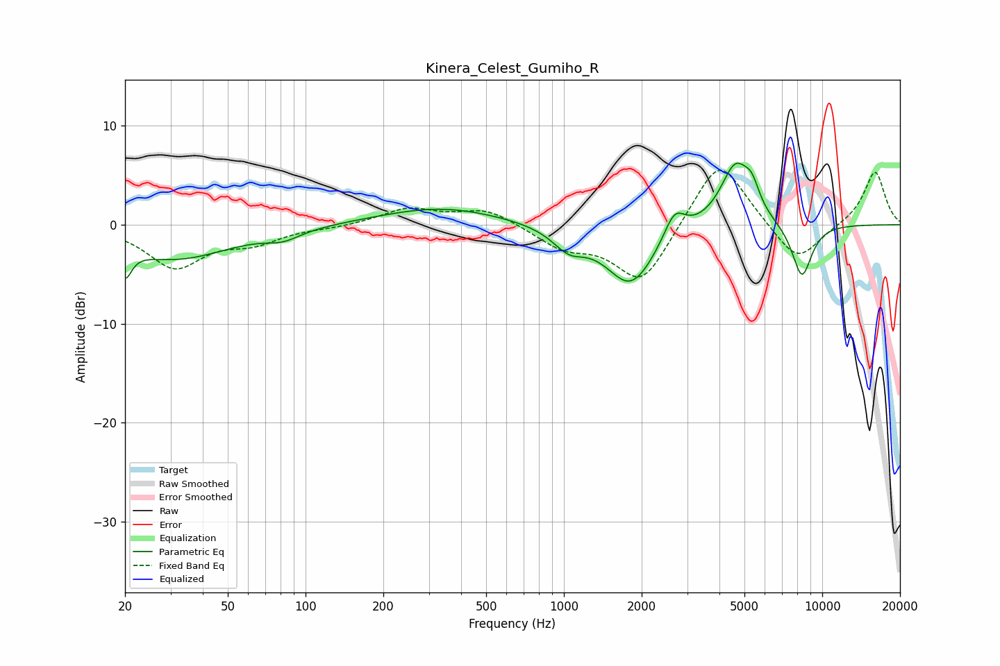

# Kinera_Celest_Gumiho_R
See [usage instructions](https://github.com/jaakkopasanen/AutoEq#usage) for more options and info.

### Parametric EQs
Apply preamp of -6.3 dB when using parametric equalizer.

|   # | Type    |   Fc (Hz) |    Q |   Gain (dB) |
|-----|---------|-----------|------|-------------|
|   1 | Peaking |        20 | 5.7  |        -2.9 |
|   2 | Peaking |        31 | 0.64 |        -3.4 |
|   3 | Peaking |        82 | 2.15 |        -0.9 |
|   4 | Peaking |       334 | 0.61 |         1.8 |
|   5 | Peaking |      1044 | 2.28 |        -2   |
|   6 | Peaking |      1813 | 1.46 |        -6.1 |
|   7 | Peaking |      2680 | 3.47 |         2.8 |
|   8 | Peaking |      4623 | 2.34 |         6.2 |
|   9 | Peaking |      5345 | 4.92 |         1.9 |
|  10 | Peaking |      8341 | 3.33 |        -5.5 |

### Fixed Band EQs
When using fixed band (also called graphic) equalizer, apply preamp of **-5.6 dB** (if available) and set gains manually with these parameters.

|   # | Type    |   Fc (Hz) |    Q |   Gain (dB) |
|-----|---------|-----------|------|-------------|
|   1 | Peaking |        31 | 1.41 |        -4.2 |
|   2 | Peaking |        62 | 1.41 |        -1.6 |
|   3 | Peaking |       125 | 1.41 |        -0.2 |
|   4 | Peaking |       250 | 1.41 |         1.6 |
|   5 | Peaking |       500 | 1.41 |         1.6 |
|   6 | Peaking |      1000 | 1.41 |        -2.1 |
|   7 | Peaking |      2000 | 1.41 |        -6.1 |
|   8 | Peaking |      4000 | 1.41 |         7.2 |
|   9 | Peaking |      8000 | 1.41 |        -4.1 |
|  10 | Peaking |     16000 | 1.41 |         5.5 |

### Graphs

