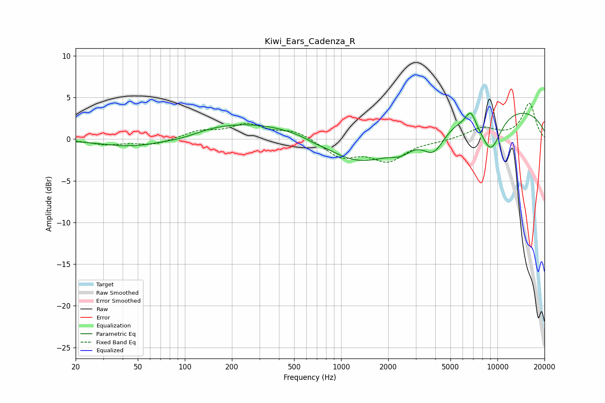

# Kiwi_Ears_Cadenza_R
See [usage instructions](https://github.com/jaakkopasanen/AutoEq#usage) for more options and info.

### Parametric EQs
Apply preamp of -3.2 dB when using parametric equalizer.

|   # | Type    |   Fc (Hz) |    Q |   Gain (dB) |
|-----|---------|-----------|------|-------------|
|   1 | Peaking |        49 | 0.68 |        -1.3 |
|   2 | Peaking |        96 | 1.1  |        -0.7 |
|   3 | Peaking |       261 | 0.28 |         2.3 |
|   4 | Peaking |       670 | 3.79 |        -0.2 |
|   5 | Peaking |      1314 | 0.61 |        -3.9 |
|   6 | Peaking |      2419 | 1.94 |        -1.3 |
|   7 | Peaking |      3907 | 1.99 |        -3.1 |
|   8 | Peaking |      6742 | 4.3  |         1.7 |
|   9 | Peaking |      9054 | 1.82 |        -4.8 |
|  10 | Peaking |      9815 | 0.23 |         4   |

### Fixed Band EQs
When using fixed band (also called graphic) equalizer, apply preamp of **-4.4 dB** (if available) and set gains manually with these parameters.

|   # | Type    |   Fc (Hz) |    Q |   Gain (dB) |
|-----|---------|-----------|------|-------------|
|   1 | Peaking |        31 | 1.41 |        -0.6 |
|   2 | Peaking |        62 | 1.41 |        -0.7 |
|   3 | Peaking |       125 | 1.41 |         0.9 |
|   4 | Peaking |       250 | 1.41 |         1.6 |
|   5 | Peaking |       500 | 1.41 |         1   |
|   6 | Peaking |      1000 | 1.41 |        -2.1 |
|   7 | Peaking |      2000 | 1.41 |        -2.5 |
|   8 | Peaking |      4000 | 1.41 |        -0.2 |
|   9 | Peaking |      8000 | 1.41 |         1.3 |
|  10 | Peaking |     16000 | 1.41 |         4.3 |

### Graphs

