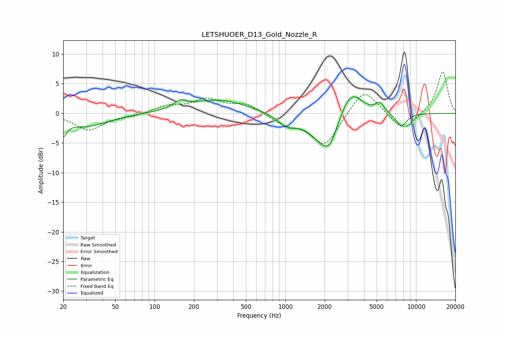

# LETSHUOER_D13_Gold_Nozzle_R
See [usage instructions](https://github.com/jaakkopasanen/AutoEq#usage) for more options and info.

### Parametric EQs
Apply preamp of -2.9 dB when using parametric equalizer.

|   # | Type    |   Fc (Hz) |    Q |   Gain (dB) |
|-----|---------|-----------|------|-------------|
|   1 | Peaking |        20 | 5.57 |        -2.5 |
|   2 | Peaking |        29 | 0.85 |        -2.2 |
|   3 | Peaking |       157 | 2.9  |         1.2 |
|   4 | Peaking |       309 | 0.66 |         2.3 |
|   5 | Peaking |      1032 | 2.03 |        -1.8 |
|   6 | Peaking |      2024 | 1.36 |        -6   |
|   7 | Peaking |      2218 | 3.89 |        -1.4 |
|   8 | Peaking |      3162 | 1.63 |         5   |
|   9 | Peaking |      5276 | 4.26 |         1.5 |
|  10 | Peaking |      7729 | 3.13 |        -2.3 |

### Fixed Band EQs
When using fixed band (also called graphic) equalizer, apply preamp of **-7.1 dB** (if available) and set gains manually with these parameters.

|   # | Type    |   Fc (Hz) |    Q |   Gain (dB) |
|-----|---------|-----------|------|-------------|
|   1 | Peaking |        31 | 1.41 |        -2.8 |
|   2 | Peaking |        62 | 1.41 |        -0.5 |
|   3 | Peaking |       125 | 1.41 |         1.1 |
|   4 | Peaking |       250 | 1.41 |         2.2 |
|   5 | Peaking |       500 | 1.41 |         1.6 |
|   6 | Peaking |      1000 | 1.41 |        -1.6 |
|   7 | Peaking |      2000 | 1.41 |        -5.5 |
|   8 | Peaking |      4000 | 1.41 |         4.5 |
|   9 | Peaking |      8000 | 1.41 |        -3.1 |
|  10 | Peaking |     16000 | 1.41 |         7.2 |

### Graphs

